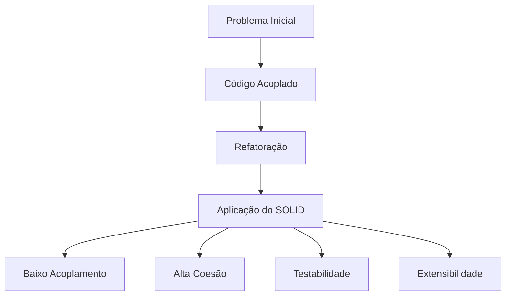
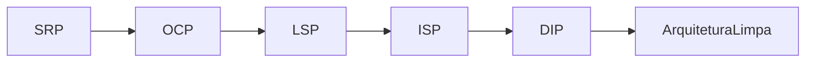

# SOLID

Projeto desenvolvido em PHP para estudo e aplicação dos princípios SOLID apresentados no curso [SOLID - Os 5 Princípios para as Boas Práticas da POO](https://www.udemy.com/course/solid-os-5-principios-para-as-boas-praticas-da-poo/).

O objetivo deste repositório é demonstrar, de forma prátia, como aplicar boas práticas da Programação Orientada a Objetos (POO) na construção de sistemas mais organizados, reutilizáveis, testáveis e sustentáveis.

O código apresentado possui finalidade exclusivamente didática e foi desenvolvido para exemplificar os conceitos abordados durante as aulas.

## Visão Geral

Os princípios SOLID foram formalizados por Robert C. Martin e posteriormente popularizados por Michael Feathers.

Esses princípios ajudam a reduzir acoplamento, aumentar coesão e melhorar a capacidade de evolução de sistemas orientados a objetos.

### objetivos do Projeto

* Demonstrar os princípios SOLID na prática
* Aplicar refatoração orientada a boas práticas
* Melhorar organização arquitetural
* Reduzir acoplamento entre componentes
* Facilitar manutenção e testes automatizados
* Construir código extensível e reutilizável

## Princípios SOLID

| Sigla | Princípio                             | Objetivo                                                                           |
| ----- | ------------------------------------- | ---------------------------------------------------------------------------------- |
| S     | SRP — Single Responsibility Principle | Uma classe deve possuir apenas uma responsabilidade                                |
| O     | OCP — Open/Closed Principle           | Entidades devem estar abertas para extensão e fechadas para modificação            |
| L     | LSP — Liskov Substitution Principle   | Subclasses devem substituir suas superclasses sem alterar o comportamento esperado |
| I     | ISP — Interface Segregation Principle | Interfaces devem ser específicas e coesas                                          |
| D     | DIP — Dependency Inversion Principle  | Classes devem depender de abstrações e não de implementações                       |

## Estrutura do Projeto

```text
solid-php/
│
├── app_carrinho_compras_b/
├── app_carrinho_compras/
├── app_crm/
├── app_etl/
├── app_etl_b/
├── app_mensageiro/
├── app_poligonos/
├── documents/
├── images/
├── .gitignore
├── README.md
└── composer.phar
```

## Tecnologias Utilizadas

### Linguagem e Ambiente

* PHP 8+
* Composer
* PHPUnit
* PSR-4 Autoload

### Conceitos Aplicados

* Programação Orientada a Objetos
* SOLID
* Refactoring
* Injeção de Dependência
* Polimorfismo
* Encapsulamento
* Abstrações
* Interfaces
* Testes Automatizados

## Como Executar o Projeto

### Pré-requisitos

* PHP 8 ou superior
* Composer instalado

### Clonar o Repositório

```bash
git clone https://github.com/JuhMaran/solid-php.git
```

### Acessar o Diretório

```bash
cd solid-php
cd solid-php/app_crm
```

### Inicializar o Composer

```bash
cd solid-php/app_crm
php ../composer.phar init
```

### Instalar Dependências

```bash
cd solid-php/app_crm
php ../composer.phar install
```

### Gerar Autoload

```bash
composer dump-autoload
```

### Executar um Projeto

Exemplo:

```bash
php -S localhost:8000
```

### Executar Testes

```bash
vendor\bin\phpunit.bat test\itemTest.php
```

## Arquitetura Geral



## Relação Entre os Princípios



## Principais Conceitos do Projeto

### Abstrações

Interfaces e contratos reduzem dependências entre comportamentos.

### Acoplamento

Dependências devem ser reduzidas sempre que possível.

### Coesão

Cada classe deve possuir responsabiliade clara e específica.

### Extensibilidade

O sistema deve crescer sem necessidade de modificar código estável.

### Refatoração

Melhor estrutura interna sem alterar comportamento externo.

### Testabilidade

Classes desacopladas são mais fáceis de testar.

## Resultado Final

Ao aplicar os princípios SOLID, o projeto evolui de uma estrutura rígida para uma arquitetura mais:

* modular;
* extensível;
* sustentável;
* previsível;
* reutilizável;
* testável.

## Referências

* [Curso SOLID - Os 5 Princípios para as Boas Práticas da POO](https://www.udemy.com/course/solid-os-5-principios-para-as-boas-praticas-da-poo/)
* [Clean Architecture](url)
* [Clean Code](url)