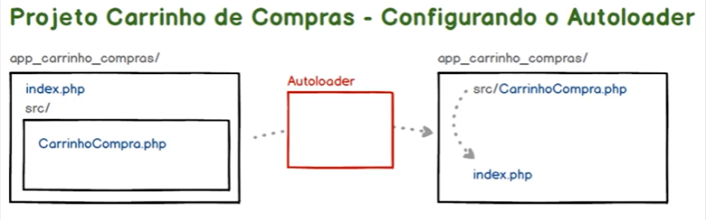

# SRP - Single Responsibility Principle

_Princípio da Responsabilidade Única_

## Iniciando o Projeto Carrinho de Compras

### Verificar se o PHP está instalado

```powershell
php -v
```

### Instalação e Configuração do Composer via Linha de Comando

```powershell
PS PS C:\...\solid-php\app_carrinho_compras> php ../composer.phar init

Package name (<vendor>/<name>) [julia/app_carrinho_compras]:
Description []:
Author [JuhMaran <julianemaran@gmail.com>, n to skip]:
Minimum Stability []:
Package Type (e.g. library, project, metapackage, composer-plugin) []: project
License []:

Define your dependencies.

Would you like to define your dependencies (require) interactively [yes]?

Package Type (e.g. library, project, metapackage, composer-plugin) []: project
License []:

Define your dependencies.

Would you like to define your dependencies (require) interactively [yes]? no
Would you like to define your dev dependencies (require-dev) interactively [yes]? no     
Add PSR-4 autoload mapping? Maps namespace "Julia\AppCarrinhoCompras" to the entered relative path. [src/, n to skip]:

{
    "name": "julia/app_carrinho_compras",
    "type": "project",
    "autoload": {
        "psr-4": {
            "Julia\\AppCarrinhoCompras\\": "src/"
        }
    },
    "authors": [
        {
            "name": "JuhMaran",
            "email": "julianemaran@gmail.com"
        }
    ],
    "require": {}
}

Do you confirm generation [yes]? yes
Generating autoload files
Generated autoload files
PSR-4 autoloading configured. Use "namespace Julia\AppCarrinhoCompras;" in src/
Include the Composer autoloader with: require 'vendor/autoload.php';
```

## Projeto Carrinho de Compras - Configurando o Autoloader

