# OCP - Open/Closed Principle (Princípio Aberto/Fechado)

## Visão Geral

Nesta seção do curso, o foco é o segundo princípio do SOLID:

> OCP — Open/Closed Principle
>
> “Entidades de software devem estar abertas para extensão, mas fechadas para modificação.”

O instrutor utiliza um projeto prático de **ETL (Extract Transform Load)** para demonstrar:

* como um sistema evolui ao longo do tempo;
* como surgem novos requisitos;
* como o código pode ficar difícil de manter;
* e como aplicar o OCP para tornar o sistema extensível.

## O que é ETL?

ETL é um padrão muito utilizado em integração de sistemas e processamentos de dados.

O nome significa:

| Etapa     | Significado | Objetivo                        |
| --------- | ----------- | ------------------------------- |
| Extract   | Extrair     | Buscar dados de várias fontes   |
| Transform | Transformar | Padronizar, tratar e organizar  |
| Load      | Carregar    | Enviar os dados para um destino |

### Fluxo do ETL

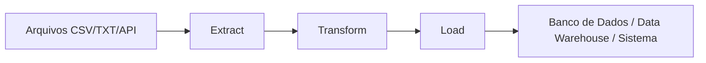

## Objetivo do Projeto ETL

O projeto criado no cruso:

* lê arquivos CSV;
* lê arquivos TXT;
* transforma os dados;
* organiza tudo em arrays;
* prepara os dados para envio a um destino.

O principal objetivo pedagógico não é o ETL em si.

O verdadeiro objetivo é mostrar:

* como organizar responsabilidades;
* como aplicar SRP;
* como perceber violações do OCP;
* e como refatorar o sistema.

## Aula 17 - Iniciando o Projeto ETL

### Objetivo da Aula 17

Nesta aula o instrutor:

* cria a estrutura inicial do projeto;
* configura o Composer;
* configura autoload PSR-4;
* prepara o ambiente para os exemplos seguintes.

### Estrutura Inicial

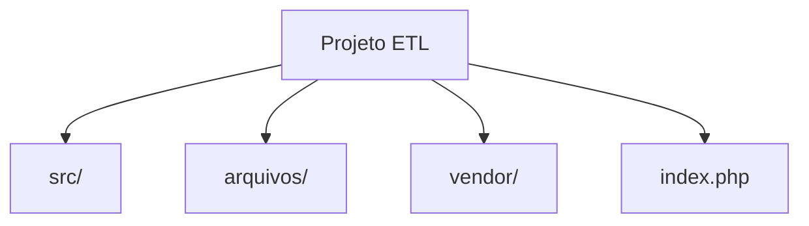

### Conceitos Importantes

#### 1. Composer

O Composer é o gerenciador de dependências do PHP.

Ele foi utilizado para:

* organizar o projeto;
* criar autoload automático;
* carregar classes automaticamente.

#### 2. PSR-4

O autoload PSR-4 permite:

* mapear namespaces;
* carregar classes automaticamente;
* evitar includes manuais.

Exemplo conceitual:

```text
Namespace -> Diretório
AppEtl\ -> src/
```

### Papel do index.php

O `index.php` foi criado para:

* servir como ponto de entrada da aplicação;
* executar os testes;
* carregar o autoload.

### Fluxo Inicial do Projeto


## Aula 18 - Leitura de Arquivo CSV

### Objetivo da Aula 18

Nesta aula o sistema aprende a:

* localizar um arquivo CSV;
* abrir o arquivo;
* ler linha por linha;
* separar colunas;
* transformar os dados em arrays.

### Aplicação do SRP (Single Responsibility Principle)

O instrutor separa responsabilidades em duas classes:

| Classe  | Responsabilidade              |
| ------- | ----------------------------- |
| Leitor  | Encontrar/localizar o arquivo |
| Arquivo | Processar o conteúdo          |

### Estrutura Inicial do Projeto da Aula 18

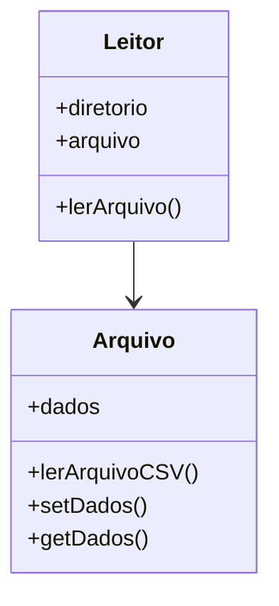

### Responsabilidade da Classe Leitor

A classe `Leitor`:

* sabe onde está o arquivo;
* monta o caminho completo;
* delega o processamento.

Ela NÃO deveria:

* interpretar CSV;
* tratar encoding;
* manipular linhas.

### Responsabilidade da Classe Arquivo

A classe `Arquivo`:

* abre o arquivo;
* lê o conteúdo;
* converte os dados;
* organiza o array final.

### Leitura de CSV

O método utilizado foi:

```php
fgetcsv()
```

Ele:

* lê uma linha;
* separa colunas;
* usa delimitador (`;`).

### Fluxo da Leitura CSV

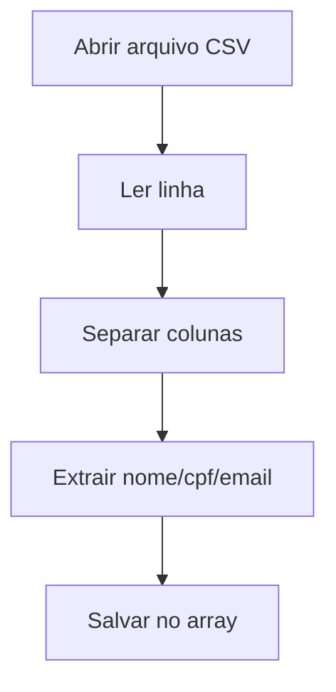

### Tratamento de Encoding

O arquivo CSV está em:

```txt
ISO-8859-1
```

Mas a aplicação trabalha em:

```txt
UTF-8
```

Por isso foi usado:

```php
iconv()
```

### O que o `iconv` resolve?

Ele converte caracteres especiais:

* ç
* á
* ã
* é

Sem isso:

```text
João -> Jo�o
```

### Estrutura dos Dados

O resultado final era:

```text
[
  {
    nome,
    cpf,
    email
  }
]
```

### Observação Importante sobre Testes

O instrutor mostra um erro simples:

* esqueceu de atribuir valor no `setter`.

Isso reforça:

> Pequenos erros podem gerar problemas grandes.

Por isso ele menciona:

* testes unitários;
* TDD;
* validação constante.

## Aula 19 - Leitura de Arquivo TXT

### Objetivo da Aula 19

Adicionar suporte a arquivos TXT.

### Diferença entre CSV e TXT

#### CSV

Separação por delimitador:

```csv
nome;cpf;email
```

#### TXT

Separação por posição fixa:

```text
[CPF][NOME][EMAIL]
```

#### Exemplo Visual

```text
35495984080Gustavo Santos                gustavo@email.com
```

### Leitura TXT

| Função   | Objetivo                |
| -------- | ----------------------- |
| fgets()  | Ler linha               |
| feof()   | Detectar fim do arquivo |
| substr() | Extrair partes do texto |

### Fluxo TXT

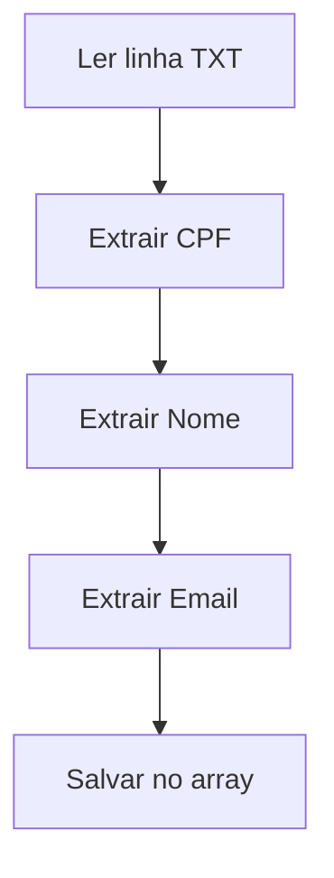

### Problema Introduzido

Neste momento o sistema começou a crescer.

Agora existem:

* CSV;
* TXT;
* lógicas diferentes.

E o sistema começou a usar:

```text
if extensão == csv
if extensão == txt
```

### Primeira Violação do OCP

A classe `Leitor` precisou ser alterada.

Sempre que surge um novo tipo:

* altera código existente;
* adiciona mais `if`s;
* aumenta acoplamento.

### Estrutura Problemática

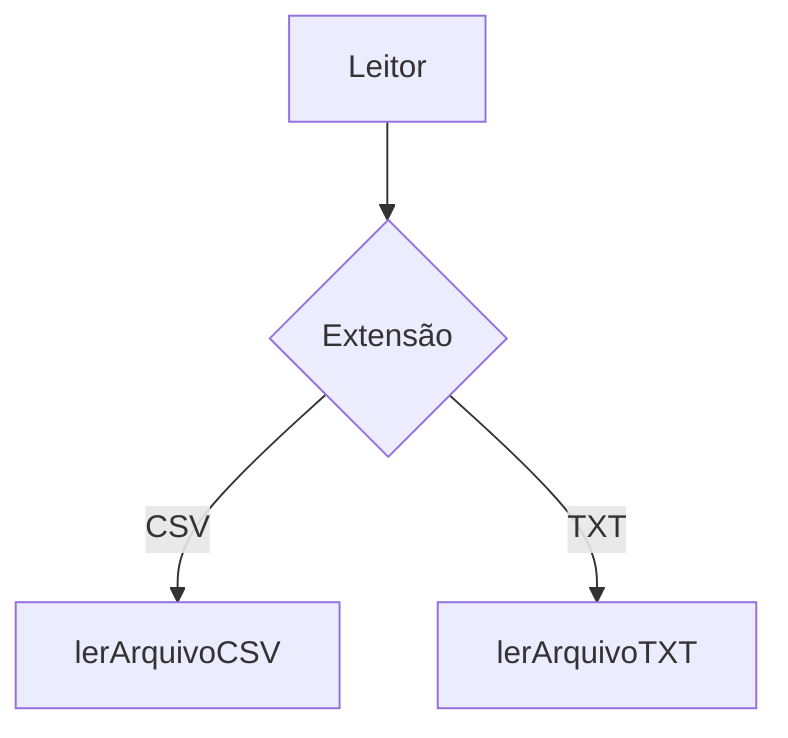

### Problema Conceitual

O sistema funciona.

Mas não é extensível.

Se amanhã existir:

* XLSX
* XML
* JSON
* API REST
* API SOAP

Será necessário modificar novamente:

* `Leitor`
* `Arquivo`

## Aula 20 - Entendendo o OCP

### Definição Principal

Classes devem estar:

* "abertas para extensão;"
* "fechadas para modificação."

### O que significa "fechado para modificação"?

Significa:

* evitar alterar código já estável;
* evitar mexer em classes existentes;
* evitar quebrar funcionalidades antgias.

### O que significa "aberto para extensão"?

Significa:

* adicionar comportamento novo;
* sem alterar comportamento antigo.

### Diferença Fundamental

| Alteração                 | Extensão              |
| ------------------------- | --------------------- |
| Modifica código existente | Adiciona novo código  |
| Mais risco                | Menos risco           |
| Mais acoplamento          | Mais flexibilidade    |
| Pode quebrar sistema      | Preserva estabilidade |

### Exemplo Conceitual

#### Errado (Alteração)

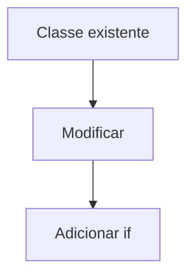

#### Correto (Extensão)

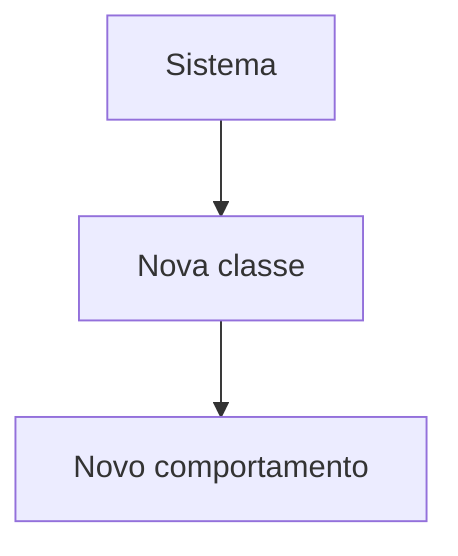

### Ideia Central do OCP

O instrutor enfatiza:

> Pensar em extensibilidade ANTES de implementar.

Ou seja:

* prever crescimento;
* prever novos comportamentos;
* evitar estruturas rígidas.

## Aula 21 - Refactoring Aplicando OCP

### Objetivo da Aula 21

Transformar o sistema em algo extensível.

### Antes do Refactoring

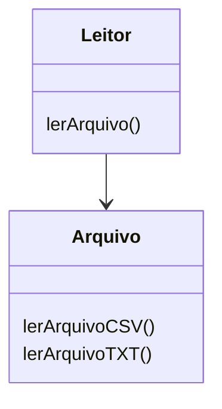

Problemas:

* muitos `if`;
* classe crescendo;
* violação do OCP.

### Depois do Refactoring

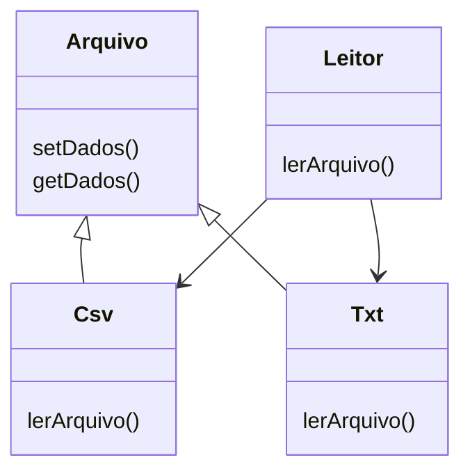

### O que mudou?

#### Antes

Uma classe fazia tudo.

#### Depois

Cada tipo de arquivo ganhou sua própria classe:

| Classe | Responsabilidade |
| ------ | ---------------- |
| Csv    | Ler CSV          |
| Txt    | Ler TXT          |

### Benefício Principal

Agora não é necessário modificar código antigo.

Basta:

* criar nova classe;
* implementar `lerArquivo()`.

### Instanciação Dinâmica

O sistema passa a descobrir a classe dinamicamente:

```text
.csv -> Csv
.txt -> Txt
```

### Fluxo Dinâmico

```mermaid
flowchart TD
    A[Leitor]
    --> B[Descobre extensão]
    --> C[Instancia classe correta]
    --> D[Executa lerArquivo()]
```

### Polimorfismo Implícito

Todas as classes:

* possuem o mesmo método;
* mas implementam comportamentos diferentes.

Exemplo:

| Classe | Método       |
| ------ | ------------ |
| Csv    | lerArquivo() |
| Txt    | lerArquivo() |

### Grande Vantagem

O `Leitor` não precisa conhecer:

* CSV;
* TXT;
* XLSX;
* XML.

Ele apenas executa:

```php
lerArquivo()
```

## Aula 22 — Vantagens do OCP

### Cenário

Novo requisito:

> Ler arquivos XLSX.

### Sistema Antigo

Precisaria:

* alterar `Leitor`;
* criar mais `if`;
* alterar `Arquivo`;
* adicionar método novo.

### Sistema Refatorado

Basta:

```text
Criar Xlsx.php
```

### Fluxo Extensível

```mermaid
flowchart LR
    A[Novo formato]
    --> B[Nova classe]
    --> C[Implementa lerArquivo()]
    --> D[Sistema funciona]
```

## Grande Benefício do OCP

O sistema cresce:

* sem alterar código estável;
* sem quebrar funcionalidades antigas;
* sem aumentar acoplamento.

## Relação entre SRP e OCP

### SRP

Organiza responsabilidades.

### OCP

Organiza crescimento.

## Resultado Final da Arquitetura

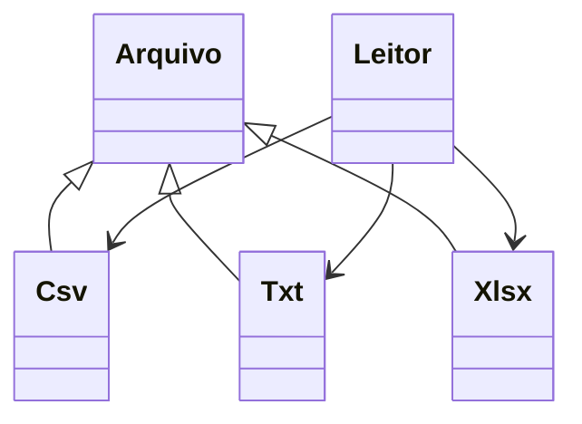

## Conceitos Mais Importantes da Seção

### 1. ETL

Processo de:

* extrair;
* transformar;
* carregar dados.

### 2. Responsabilidade Única (SRP)

Cada classe faz apenas uma coisa.

### 3. OCP

Extender ao invés de modificar.

### 4. Refactoring

Melhoria estrutural sem alterar comportamento.

### 5. Extensibilidade

Capacidade do sistema crescer sem quebrar.

## Resumo Final

Nesta seção o curso mostrou:

1. Como criar um projeto ETL;
2. Como ler CSV;
3. Como ler TXT;
4. Como separar responsabilidades;
5. Como perceber violações do OCP;
6. Como refatorar o sistema;
7. Como criar arquitetura extensível;
8. Como evitar alterações constantes em código existente.

A principal lição da seção é:

> Sistemas mudam constantemente.
>
> OCP existe para permitir evolução sem destruir estabilidade.