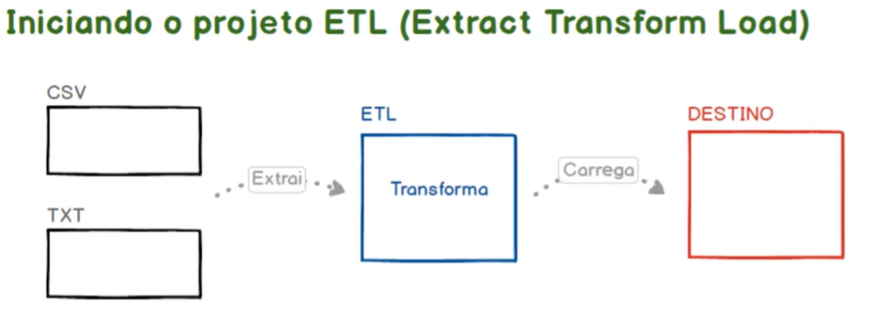
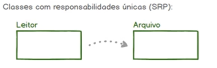

# OCP - Open/Closed Principle

_Princípio Aberto/Fechado_

## 17. Iniciando o Projeto ETL (Extract Transform Load)

Muito bem dando continuidade ao estudo dos princípios sólidos. A partir dessa aula nós vamos falar sobre o Open Cloud principal ou princípio aberto fechado. Mas antes de entrarmos na parte teórica e na parte prática desse princípio nessa aula nós vamos nos concentrar na inicialização do nosso projeto onde vamos de fato aplicar esse princípio. Ok. Qual o projeto que nós vamos criar nessa sessão. Será o projeto Ted de que se trata de transformá lo. Trata se de uma aplicação um tipo de aplicação de mercado responsável por extrair informações de diversas origens diferentes. Transformar essas informações é empurrar carregar essas informações para um destino. Esse disco não pode ser um banco de dados data Marcos com data warehouse como também pode ser uma ou outra aplicação uma aplicação final. Eu sugiro que você pesquise um pouco sobre tela sobre abstract transforme Cloud. Caso você não conheça esse tipo de aplicação é um recurso bem interessante. Quando estamos falando de sistemas que fazem muitas integrações fica a dica será um projeto bem interessante para nós nesse momento. Ok então vamos lá. Sem segredo aqui dentro do diretório Solid eu vou criar mais um diretório que eu vou chamar de meu lar. Na sequência vou acessar aqui dou dois aninhos com Madonna ou copiar aqui o caminho completo desse diretório legal. Lembrando que aqui um diretório acima nós já temos o Composer. Nosso projeto será escrito em PHP. Vamos utilizar o Composer para isso. Então aqui dentro do diretório BTL eu vou subir um nível para acessar o Composer. Por falar vamos iniciar o nosso projeto podemos pegar aqui o nome sugerido vamos avançar ele pede aqui um autor então podemos definir aqui colocar o meu nome no meu e-mail. Muito bem vamos avançar. Aqui podemos falar que não queremos tratar das dependências agora nem de produção nem de desenvolvimento. Vamos confirmar aqui olha só a criação do Composer portuguesa. Só teclar Enter. Bacana. Vamos dar uma olhada aqui. Aqui está. Agora vamos abrir o nosso projeto Petrelli em um editor de texto de código fonte ou em uma ideia de sua preferência. No meu caso eu vou seguir utilizando o Visual Studio Code ao clicar aqui fail folder Space vamos selecionar o diretório do projeto aqui está o arquivo Composer ponto e eu vou incluir aqui a entrada do Outlook e do Composer pra fazer o carregamento automático dos componentes das classes da nossa aplicação aqui tão bem sem segredo. Vou incluir a entrada altura onde vamos passar aqui como o valor um objeto que por sua vez conterá a entrada TSR 4. O valor será um novo objeto que vai escrever aqui qual será o país e qual será o diretório origem para esse país. Vamos passar aqui SC Barra Barra indicando que esse é o nome Express na sequência passará pelo diretório raiz na nossa aplicação muito bem. Agora é só criar esse diretório e por fim através da linha de comando executar a instrução história do Composer ou utilizar o Composer que está um nível acima do diretório do projeto. Nesse momento eu estou dentro do diretório do projeto então eu estou subindo o nível para executar o Composer passando a instrução estola. Vamos aguardar aqui a finalização o que é basicamente o download das dependências do auto iludido Composer que servirá para fazer os carregamentos automáticos dos clipes da nossa aplicação. A instalação foi concluída. Repare que aqui no diretório do projeto foi criado o diretório venda e aqui dentro nós temos o UOL Tablóide bacana. Vamos criar agora um script que será muito útil na nossa aplicação. O escolhido que vai permitir criar os objetos com base nas classes para testar mais adiante o princípio Open closed. Então vou colocar aqui a extensão ponto PHP. Vamos abrir aqui apego à HP e vamos fazer um Claire recuperando aqui o script autor do PHP dentro do diretório venda. Então basta passar aqui Barra venda Barra Outlook PHP. E aí eu vou dar um eco aqui daí string funcionando para fechar a sala aqui no diretório do projeto vamos executar PHP espaço traço S maiúsculo para servir mas essa aplicação que podemos utilizar localizou se na Porta 8 mil. Qualquer servidor web embutido do PHP subiu a aplicação através do browser. Nós podemos recuperar aqui a aplicação através do local Rust suporta 8 mil conforme definimos aqui na instrução de criação do nosso servidor. Bacana tudo ok. A partir da próxima aula nós vamos começar a implementar o nosso eterno sem nos preocuparmos. Nesse primeiro momento com o Open closed principal troquei apenas levando em consideração o paradigma de orientação a objetos e também o S&P ou single responsabilidade por isso isto porque esse sim é o princípio que nós nesse momento já conhecemos. Então até a próxima aula.



Arquivos CSV e TXT --Extrai--> ETL (Transforma) --Carrega--> DESTINO (exemplo: banco de dados)

### Sobre ETL

_Explicar/Responder as perguntas abaixo_

1. O que é ETL?
2. Quais suas etapas?
3. Para que serve?
4. Qual sua importância?
5. Quais são as ferramentas comuns?

## 18. Projeto ETL - Lendo um arquivo CSV

Dando continuidade ao desenvolvimento do projeto tele aula nós vamos trabalhar implementando a leitura de arquivos CSV. A ideia nessa aula é criar duas classes a classe `leitor` e a classe `arquivo` cada classe com as suas responsabilidades únicas. A classe arquivo vai ser responsável pelo arquivo em si pelo seu respectivo conteúdo. é uma classe que poderia tratar as informações contidas dentro do próprio arquivo poderia ajustar um dos caracteres poderia remover linhas inválidas. Enfim a responsabilidade dela sobre o arquivo CSV que será lido. Já a classe leitor ela será responsável por definir qual que é o local onde esse arquivo se encontra. Ela será uma classe bastante simples. Ela vai funcionar como uma espécie de interface mas ela poderia no futuro ser estendida ela poderia atestar a existência do arquivo antes de tentar ler esses arquivos. Ela poderia abrir e testar conexões de rede para recuperar arquivos por exemplo que estivessem em repositórios FTP. Enfim a classe leitor fica responsável por essa interface de leitura enquanto a classe arquivo fica responsável pelo arquivo em si. Então vamos lá. Voltando aqui no código aqui dentro de `src/` eu vou criar a classe `Leitor.php` e a classe `Arquivo.php`. Vamos começar aqui pela classe leitor. Vamos criar aqui dois atributos o primeiro atributo será o `diretorio` local onde o arquivo se encontra, o segundo atributo será o `arquivo` em si, o nome e a extensão desse respectivo arquivo. Na sequência vamos criar aqui os métodos `get` e `set`, desses respectivos atributos de modo fluído. Aqui no `get` nós vamos dar um `return $this->diretorio();`, vamos fazer o mesmo para `arquivo`. Vou copiar aqui para facilitar um pouco (`return $this->arquivo();`). Legal nós faremos aqui os métodos `set` também. vamos receber aqui o diretório. Nesse caso mais é o arquivo também. E aí nós podemos inclusive para que os retornos desses métodos não vou falar que esse método ele retorne mais trendy. Esse método também já que nós estamos equipando os parâmetros nós podemos equipar também os retornos. O nosso próximo passo é criar aqui um método que vai de fato ler o arquivo e aí nós podemos ter um `echo` aqui da mensagem `'teste'` Ok. Feito isso aqui no índex vamos recuperar o namespace mais especificamente a classe leitor. Dentro desse namespace, vou criar aqui uma variável chamada leitor que vai receber um `new Leitor();`. E aí nós podemos executar o método ler arquivo. Esse método aqui olha só só para verificar se de fato a nossa classe está funcionando. Voltando aqui no browser vou atualizar está lá. Agora nós precisamos trazer aqui pra nossa aplicação o arquivo CSV que será lido pra facilitar eu disponibilize como um recurso dessa aula um arquivo chamado `arquivos_necessarios.zip`. é só fazer o download descompactar aqui dentro nós teremos um diretório chamado arquivos e dentro desse diretório um arquivo chamado dados do CSV nós podemos recortar esse diretório e colocar dentro do nosso projeto até aqui na raiz do projeto mesmo. Vamos voltar aqui para o código e vamos configurar o nosso leitor. Eu vou passar aqui o diretório se você se lembra bem. Nós temos um atributo que guarda essa informação. Vou utilizar o método `set` para definir. Então nós podemos passar aqui lá o diretório como sendo `'/arquivos'`. Aqui está o diretório para não ter erro eu vou concatenar aqui o caminho completo até esse script também. Na sequência nós vamos fazer a mesma coisa 'setando' o nome do arquivo. Vou apenas confirmar aquele atributo `setArquivo` legal. Então o nome do arquivo vamos confirmar aqui `dados.csv`. Dessa forma aqui no leitor nós podemos trazer esse caminho para o contexto ou criar a variável caminho. Vou atribuir aqui o `this->getDiretorio()` concatenando essa informação com uma `.'/'` na sequência concatenar com `.$this->getArquivo();`, formando portanto o caminho completo até esse arquivo. Só nós podemos testar aqui ou voltar aqui no navegador. Ele deu um erro aqui falou que `getDiretorio()` retorna um valor vazio. Vamos dar uma olhada. A chamada do método está OK, o atributo também está OK. Vamos dar uma olhada no index.php. Vamos testar aqui o método `set`. Aqui olha só faltou atribuir. Eu criei o método `set` copiando a informação dos métodos `get` e esqueci de ajustar aqui a atribuição do valor ao que nós pagaríamos se estivéssemos fazendo os testes unitários. Logo de cara se estivéssemos utilizando a metodologia TDD. Então fica a dica, olha como os testes são importantes, nesse caso esses erros eles foram bastante simples. Mas repare que erros pequenos acontecem. Então erros pequenos podem gerar erros complexos difíceis de serem testados depois. Então fica a dica reforçando a importância dos testes unitários. Vamos voltar aqui no navegador tá lá temos o caminho completo. Muito bem voltando aqui no nosso código. O que nós podemos fazer agora que temos esse caminho, é delegar esse caminho para classe `Arquivo.php`, o objeto que vai controlar de fato o arquivo. Vamos criar a nossa classe `Arquivo.php`, vou definir aqui o `namespace`. Vamos criar uma função aqui, que vou chamar de `lerArquivoCSV()` que vai receber o `$caminho`. Portanto aqui no leitor vamos dar um `use src\Arquivo`. Ou seja vamos recuperar aqui desse namespace a classe arquivo e aqui vamos criar uma variável chamada `$arquivo$` que vai receber `new Arquivo();`. Na seqüência nós vamos pegar esse objeto e vamos executar o método do arquivo CSV passando o caminho também novamente a classe leitor. Repare que ela está atuando como uma interface para no futuro ter as responsabilidades de leitura sobre as variáveis tipos de arquivos que podem compor o nosso ETL. Por isso nesse momento parece até um pouco redundante mas lembre-se é natural ter essa sensação. A sensação de que temos classes desnecessárias mas porque nós estamos trabalhando com as responsabilidades únicas isso vai ter impacto direto em como nós vamos implementar os outros princípíos SOLID. Ou então vamos lá retornando ao nosso código. Nós estamos encaminhando para o método `lerArquivoCSV($caminho)`, nós podemos testar.
Aqui é esperado um `string` (`lerArquivoCSV(string $caminho)`), depois mas podemos tipar qual o retorno do método, caso exista de fato um retorno. Vamos por partes. Vou apenas ver se estamos chegando até esse ponto. Olha só que ele um erro aqui na linha 3 vamos confirmar por quê. Até porque aqui nós precisamos definir o `namespace`.
No código o instrutor colocou: `use src;` e o correto é `namespace src;`
Agora sim. Bacana então chegamos até esse ponto. Nós podemos implementar aqui a abertura do arquivo e recuperação de seu conteúdo. Então vou criar uma variável chamada `$handle` que vai exibir aqui o resultado `resource` do método `fopen()` nativo do PHP, responsável por abrir um arquivo `open file`, ok! E aí nós vamos passar aquele caminho com o parâmetro de leitura. Dessa forma nós temos o `$handle` apontando para um arquivo que foi aberto. Nós podemos portanto acessar cada uma das linhas desse arquivo recuperando seu respectivo conteúdo. Então aqui dentro do `while()` eu vou declarar uma variável chamada `$linha` que vai receber o retorno do método `fgetcsv()`. Esse método também é nativo do PHP. Aqui nós passamos o `$handle` e temos também a possibilidade de definir mais alguns parâmetros como por exemplo a quantidade máxima de linhas que queremos ler dentro desse arquivo, por exemplo 10 mil linhas (`10000`) e também que é o caractere limitador das colunas de cada uma das linhas contidas no arquivo. Nesse caso o nosso CSV é separado por ponto e vírgula (`;`). Então basta passar essa informação aqui também. E aí nós podemos abrir aqui o arquivo de dados CSV só para entender um pouco melhor. Olha só repare que nós temos aqui um nome separado por ponto e vírgula do CPF separado por ponto e vírgula do e-mail (`nome;cpf;email`). Então nós temos três colunas quatro linhas. Nós temos também aqui um erro de code porque o arquivo que eu criei o arquivo CSV provavelmente está configurado para ISO88591. O meu editor está configurado para o UTF-8. Então ele dá um conflito, mas não se preocupe porque nós vamos resolver isso aqui no código ok vamos fechar aqui. E aí. Claro que nós precisamos de um critério de parada o `fgetcsv` possui um cursor interno sempre quando ele é executado ele recupera a próxima linha do arquivo até um determinado momento que não existem mais linhas para serem recuperadas. A linha não tem conteúdo então ele retorna para a gente `false` e essa informação pode ser utilizada como critério para Parada do nosso laço. Nós podemos pegar todo esse resultado aqui e testar esse laço só vai acontecer enquanto o retorno for diferente de falso (`!== false`). Pronto. Dessa forma nós temos aqui um critério de parada. Agora vamos dar um `print_r($linha);` que está recebendo a cada uma das iterações do nosso `while` o resultado prometido aqui dentro de `fgetcsv()` vou salvar o nosso script. Vamos voltar aqui no browser e vou atualizar tá lá. Estamos recuperando os registros. Aqui está o erro code. Mas vamos por partes. Voltando aqui no nosso código. O próximo passo é pegar minha linha ou até dar `echo <br>` para quebra de linha para facilitar a leitura. A ideia aqui é pegar linha a linha e atribuir essas informações ao aqui ou seja ao atributo do Objeto arquivo. Voltando aqui no código vamos criar mais um atributo que eu vou chamar por exemplo de `private $dados` que será iniciado aqui com array vazio (`= array();`). Muito bem. E aqui para cada linha nós vamos recuperar a informação contida na coluna zero. Nesse caso no índice zero que o nome, mas recuperar também o CPF que está aqui na posição 1, e o email que está na posição 2 ok. E aí nós podemos fazer o seguinte, vou recuperar aqui `$this->setDados()` e nós vamos passar o nome, o CPF e o email (`$this->setDados($linha[0], $linha[1], $linha[2])`). E aí vamos implementar nosso método `setDados()`, então ele passa a receber o nome, CPF e o e-mail. Definir que cada parâmetro é uma string. Todos aqui, parâmetros de texto (`string`). Nesse caso como uma função `set`, não tem retorno. Então podemos 'tipá-la' do tipo `void`. E aí sim nós vamos utilizar `$this->dados.push(['nome' => $nome, 'sobrenome' => $sobrenome, 'email' => $email]);`. Então, podemos testar, após executar o `while`. Nós podemos dar um `print_r($this->dados)`. Vamos acessar o atributo diretamente, pois é apenas um teste. Para verficar se de fato está sendo preenchida corretamente com as informações dentro do array. Vamos voltar para o Browser/Navegador. Ops. Deu um erro: um parâmetro passado para `setDados()` não é uma instância. `string` estava escrito errado. Agora sim vamos voltar novamente aqui vamos atualizar. Olha só tivemos aqui um novo erro por causa do `push` vamos voltar aqui no código. A anotação no PHP é um pouco diferente. No PHP usamos o método `array_push`, com nosso atributo (`$this->dados`) e na sequência a informação que queremos adicionar dentro desse array. Nesse caso, o outro array e valores: `['nome' => $nome, 'sobrenome' => $sobrenome, 'email' => $email ]`. Muito bem, vamos voltar aqui no navegador. Agora sim. Bom nós estamos na reta final aqui da implementação do fluxo de leitura de arquivo CSV pelo nosso ETL. Vamos apenas fazer mais alguns ajustes vamos acertar essa questão do `encoding` que está apresentando aqui para nós um caractere inválido. Aqui no código. Nós podemos tratar isso no `array_push`. Ajustando a identação para facilitar a leitura. Podemos recuperar este valor e submeter esse valor também nativo do PHP, que é o `iconv`, que é um conversor de encoding. Basicamente ele espera que o um encoding atual e um encoding esperado (`'nome' => iconv('encoding atual', 'encoding esperado', $nome),`). Então por exemplo o nosso arquivo CSV, foi armazenado como contendo o econding `iso-8859-1` (encoding atual) porque o idioma do meu sistema operacional é o português do Brasil. O Excel entendeu que o conjunto de caracteres que deve ser utilizado dentro do arquivo é o conjunto de caracteres que faz parte da tabela iso-8859-1. Porém, a aplicação trabalha com UTF-8. Vamos pegar este valor `$nome` que esta em iso-8859-1 e converter para UTF-8 (encoding esperado), para corrigir na aplicação. O instrutor precisou remover `;` e colocar `,`. Com isso o problema deve ser resolvido. Olhando no navegador, apresenta a correção esperada. O próximo passo é criar uma função que irá retornar o array de dados.

```php
public function getDados(): array {
    return $this->dados;
}
```

Sem segredos. Desta forma, podemos remover o trecho de código do método `lerArquivoCSV()`:

```php
echo '<pre>';
print_r($this->dados);
echo '<pre>';
```

`lerArquivoCSV` se torna apenas um método de processamento com retorno do tipo `void`. Em `Leitor.php`, após executar esse processamento nós podemos dar `return $arquivo-getDados();`. E podemos incluiro o retorno na assinatura do método:

```php
public function lerArquivo(): array {
    $caminho = $this->getDiretorio().'/'.$this->getArquivo();
    echo $caminho;
    $arquivo = new Arquivo();
    $arquivo->lerArquivoCSV($caminho);
    return $arquivo->getDados();
}
```

Método `setArquivo`, também incluir retorno do tipo `void`. Os métodos `set`, apenas processam não possuem retorno (`void`). Classe Leitor e Arquivo implementadas.

Apenas ajustar o index.php, para testar o retorno da leitura do arquivo. Incluir o trecho abaixo, para verificar se de fato estão retornando as informações esperadas que contém o arquivo CSV.

```php
echo '<pre>';
print_r($leitor->lerArquivo());
echo '<pre>';
```

Retornando no browser. Vamos atualizar. Está lá, tudo funcionando corretamente. Implementamos portanto a leitura de arquivo CSV dentro do ETL e nós também queremos classes com responsabilidades únicas. Ou seja já temos um ambiente ideal para iniciarmos os nossos testes sobre o Open/Closed Priciple. Então até a próxima aula.

### Classes com Responsabilidades Únicas (SRP)



## 19. Projeto ETL - Lendo um arquivo TXT

## 20. Entendendo o Open/Closed Princple (OCP)

## 21. Refactoring do Projeto - Aplicando o Princípio na Prática

## 22. Testando as Vantagens do OCP

## Comandos

```bash
php ../composer.phar init
php ../composer.phar install
php -S localhost:8000
```

## Código

* app_etl/composer.json

```json
{
    "name": "julia/app_etl",
    "autoload": {
        "psr-4": {
            "AppEtl\\": "src/"
        }
    },
    "authors": [
        {
            "name": "JuhMaran",
            "email": "julianemaran@gmail.com"
        }
    ],
    "require": {}
}
```

* app_etl/index.php

```php
<?php

require __DIR__ . '/vendor/autoload.php';

echo 'Funcionando';
```