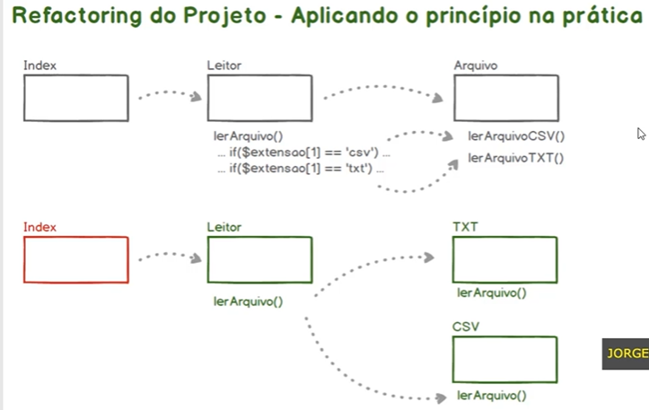

# OCP - Open/Closed Principle

_Princípio Aberto/Fechado_


> Uma entidade de software, tais como classes, módulos, funções etc., devem sempre estar abertas para extensões, mas fechadas para modificações.
> O que é uma alteração?
> O que é uma extensão?

## 21. Refactoring do Projeto - Aplicando o Princípio na Prática



Na aula anterior vemos que o Open/Closed Principle sugere que as classes estejam sempre abertas para expansão e fechadas para a alteração. Em outras palavras esse princípio ele sugere que a gente faça um exercício de abstração mais sofisticado, ou seja, que a gente pensa nos componentes da nossa aplicação que o modo extensível sempre quando um novo recurso for agregado a uma determinada aplicação que essa agregação seja feita através de uma extensão e não uma alteração no código já existente. É claro que em muitos casos na prática nós vamos precisar adaptar os nossos códigos para que eles se tornem cada vez mais extensíveis. Mas o conceito desse princípio é que a gente fique de olho nisso que a gente pense nisso sempre quando formos abstrair as nossas classes para que o nosso Código tenha essa característica de sensibilidade ao invés de sempre ter que voltar nos códigos pré existentes para fazer os ajustes. Para entender um pouco mais como nós podemos pensar dessa forma. Nessa aula nós vamos fazer um refactoring do projeto ETL. Temos duas classes, Leitor e Arquivo, de modo que embora elas possuam responsabilidades únicas sempre quando um novo método de leitura for implementado nós precisaríamos mexer, fazer alterações na classe Leitor e Arquivo. Ou seja, ferindo o Princípio Open/Closed. Portanto nessa aula nós vamos modificar um pouco o nosso código para que ele tenha essa habilidade de extensão. Nós vamos ajustar a classe leitor e vamos substituir a classe arquivo por classes específicas como TXT (`lerArquivo()`) e CSV (`lerArquivo()`) característica de estender conforme a necessidade. Então nós teremos uma classe TXT e teremos uma classe CSV de modo que no futuro a nossa aplicação passasse a ler arquivos XLSX ao invés de voltar e alterar a classe leitor e a classe arquivo. Nós poderíamos apenas estender a nossa aplicação criando uma nova classe XLSX que entraria nesse fluxo de modo natural sem que as classes pré existentes sejam modificadas. Ou seja, nós estamos partindo de uma ideia de alteração do nosso código pra se adaptar às necessidades de negócio que a nossa aplicação se propõe a resolver para uma metodologia de extensão desses potenciais novos recursos que a nossa aplicação possa vir a ter. Abrir diretório SOLID, onde estão os projetos. Fazer uma cópia do projeto `app_etl`. Criando assim, um segundo projeto chamado `app_etl_b`. Abrir o projeto na IDE VSCode. Abrir o terminal e ir até o diretório `app_etl_b` para servir essa aplicação através do servidor PHP (`php - S localhost:8000`). Acessar o navegador e verificar se a aplicação está funcionando corretamente.

Vamos voltar aqui no nosso código e qualquer ideia vou abrir aqui a classe arquivo eleitor e nós vamos

deixar de ter portanto a classe arquivo vamos criar outras duas classes e eu vou criar essas duas classes

dentro de um novo diretório aqui em SC que eu vou chamar de trator aqui aqui dentro eu vou criar o arquivo

TXT ponto PDT e vou criar também um arquivo CSV hp.

Vamos começar aqui pelo arquivo TXT vou abrir aqui até para ter vou definir espécie como sendo SRC Barra

Illustrator less TXT ok vou copiar esse código aqui para facilitar vamos fazer o mesmo aqui para o CSV.

Agora nós podemos aqui a partir da classe arquivo copiar algumas informações por exemplo ou aproveite

dados.

Na verdade vamos fazer melhor ainda.

Ao invés de remover essa classe eu vou fazer o seguinte eu vou movê la aqui pra dentro.

Aqui eu vou comentar esse trecho de código olha só

de modo que as nossas classes que derivam aqui desse arquivo eles vão simplesmente estender essa classe

para herdar o atributo dados e os métodos de manipulação desse atributo.

Então aqui nós podemos dar um ao arquivo lembrando que nós precisamos ajustar aqui uma espécie tão.

E aí aqui nós podemos fazer o mesmo para o sexo e metal.

O nosso desafio agora será implementar aqui em txt CSV de leitura.

Nós temos esses métodos aqui.

Então vou copiar esse trecho de código aqui.

Vou colocar aqui na classe B Vou copiar esse outro trecho de código aqui o método de leitura TXT vou

colocar na classe TXT vou substituir o nome apenas para ler arquivo.

A mesma coisa aqui.

O próximo passo está na classe leitor decidir como que nós vamos de fato ler os arquivos então vou comentar

esse trecho de código e vou fazer o seguinte o caminho nós vamos continuar utilizando a extensão também.

O desafio agora é decidir qual classe está assim e como executar o método.

De acordo com o arquivo que nós estamos trabalhando então repare que as nossas classes que elas possuem

o mesmo nome e as extensões que estamos recuperando dos nossos arquivos.

Nós temos aqui a extensão ponto CSV TXT.

Então nós podemos utilizar a referência de extensão para a instância classe correta e com base na instância

da classe correta chamada com o método correspondente na inerente àquela respectiva classe.

Olha só que eu vou fazer o seguinte eu vou criar uma variável chamada classe que vai receber a extensão.

Lembrando que essa extensão está na posição aqui Black Cloud do nome do arquivo que estamos passando

como referência aqui na classe leitor olha só pra testarmos eu vou dar um eco classe e na sequência

voltaram a sair aqui pra que o código seja interrompido.

Vamos voltar aqui no Brasil vou atualizar tá lá tá retornando TXT porque aqui no índex vamos abri lo

aqui ele chega até esse ponto seta aos atributos na sequencia executam mais tolerar que chega até esse

ponto.

Já faz a impressão da extensão e o processamento interrompido.

Então nós estamos chegando até esse ponto com a extensão aqui do arquivo.

Nós podemos utilizar o método você Forest nativo do PHP para fazer com que o primeiro caractere dessa

estrela fique maiúsculo.

Olha só dessa forma nós temos condições de usar essa referência de extensão para distanciar o objeto

com base na quase correta já que a classe recebe o mesmo nome da instituição.

Para fazer isso de modo dinâmico sem que seja necessário toda hora voltar nessa classe para fazer aquilo

hoje.

Tornei me espécie correta.

Lembrando que se nós quiséssemos utilizar aquele TXT CSV que nós precisaríamos trazer essas informações

aqui para o contexto essas classes para o contexto sem que seja necessário ficar voltando aqui toda

hora para fazerem inclusões novas novos métodos de extração.

Nós podemos aqui utilizar o caminho completo do MySpace espécie para fazer a instalação da classe.

Então vou trazer aqui um método você Forest aqui pra cima é a classe.

Ela vai ter essa referência aqui com Cat concatenar com o espécie SRC Illustrator aqui no final nós

precisamos utilizar duas vezes a barra pra que uma das barras escape aqui corretamente a barra seguinte

pra que a gente possa passar aqui essa história como referência para compor o caminho completo da classe

referenciada aqui ou no espaço a partir da raiz.

Dessa forma Olha só vou dar um berro aqui vamos voltar aqui no navegador.

Ele deu um erro na linha 34 porque ficou aqui esse parênteses sobrando aqui no código legal.

Olha só reparei que nós temos a referência com nenhuma espécie na nossa classe.

O próximo passo agora que temos essa referência completa a executar o método ler arquivo contido dentro

da classe.

Pra fazer isso nós vamos utilizar uma função nativa do PHP que é a coisa o fundo que é o método que

recebe basicamente dois Harris como parâmetro.

O primeiro rei indica qualquer classe que precisa ser instancia Ada e qualquer um método dentro da classe

que será executado.

Segundo lei indica quais serão os parâmetros que serão passados para o metro dentro daquela respectiva

classe.

Então vamos fazer isso vou executar aqui um metro do COL José Fonte

passando aqui como um parâmetro 2 ais o primeiro rei novamente.

Nós vamos dar um passo à máquina em especial da classe que queremos instancia o segundo índice desse.

Reinaldo esse primeiro parâmetro será o método dentro dessa classe.

Nesse caso ler arquivo.

Muito bem.

Nosso primeiro parâmetro está pronto.

O segundo parâmetro que também é rei conterá que a relação de parâmetros que serão encaminhadas para

esse método.

Então o que esse método espera receber é uma string como caminho.

Olha só nós vamos passar aqui com o caminho e por fim uma vez executando esse método nós podemos fazer

com que as nossas classes retornem os dados.

Todos esses dados aqui estão sendo recuperados dos respectivos arquivos e estão sendo atribuídos a variável

dados que é herdada de arquivo.

Então nós podemos utilizar o método público de dados para recuperar essa informação aqui no final

para tornar esse valor leitor.

E aí o nosso Matteo olha só.

Repare que ele está aqui equipado como o seu novo site mas como agora ele tem um retorno ele retorna.

Então nós precisamos ajustar isso também nós vamos fazer isso aqui para o TXT processo.

Bacana.

Voltando aqui um leitor nós podemos tirar aqui esse trecho de código.

Como esse método vai tornar os dados só nós podemos na sequência dar um retorno do resultado da chamada

dengue

bacteriana.

Vamos testar.

Vou voltar aqui no Brasil.

Vou atualizar.

Ele deu um erro na linha 34 vamos confirmar o que foi o nome da função aqui.

UOL Qual é o seu futuro.

Agora sim vamos voltar aqui.

Vou atualizar tá lá tudo funcionando direitinho.

Porém levando em consideração agora uma metodologia de expansão do código ao invés de sempre ter que

voltar aqui na classe leitor para adaptar basta chamar o método que já está preparado para executar

a classe que contém toda a lógica para ler um determinado arquivo.

Então ao ler novos arquivos ou até mesmo informações de outras origens nós podemos fazer isso através

dessa habilidade de extensão.

Basta criar uma classe que manipule esse tipo de leitura implementando matou ao ler arquivo e automaticamente

essa nova classe vai se encaixar aqui estendendo a capacidade de funcionalidade da nossa aplicação. Vamos ver aqui se tem coisas para serem removidas no nosso código ou apenas tirar esses comentários. Repare que as classes vão ficando bem mais simples mas ficam classes menores sendo utilizadas de modo isso atendendo a dois principios da sorte ou princípio de responsabilidade uma única é o princípio de aberto e fechado na próxima aula. Nós vamos fazer um teste em relação às vantagens desse princípio quando surgem essas necessidades de mudança de melhorias e adaptação dos nossos códigos para atender às novas necessidades. Então até a próxima aula.

## 22. Testando as Vantagens do OCP

## Comandos

```bash
php ../composer.phar init
php ../composer.phar install
php -S localhost:8000
```