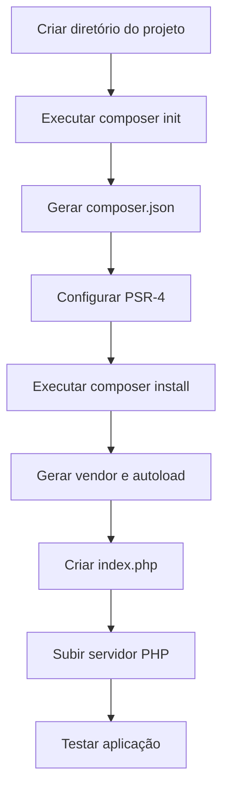
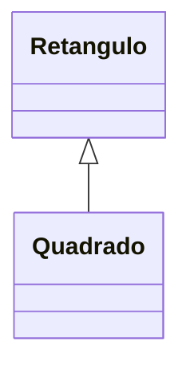
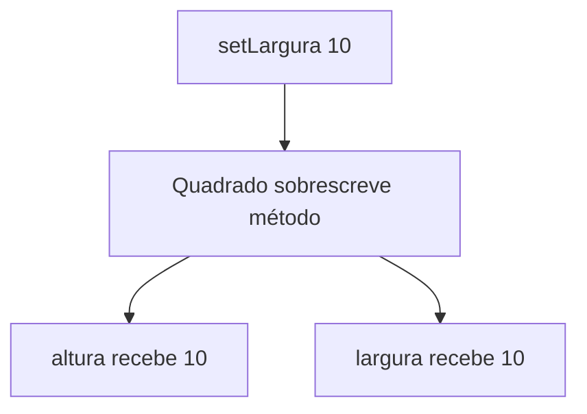
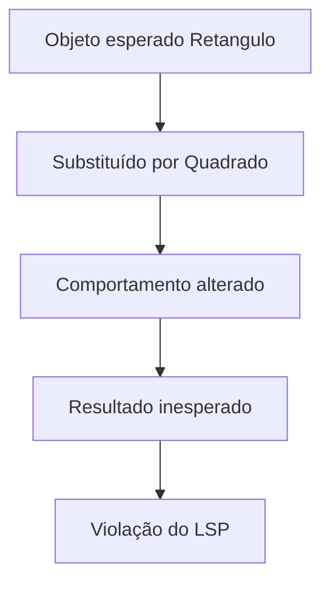
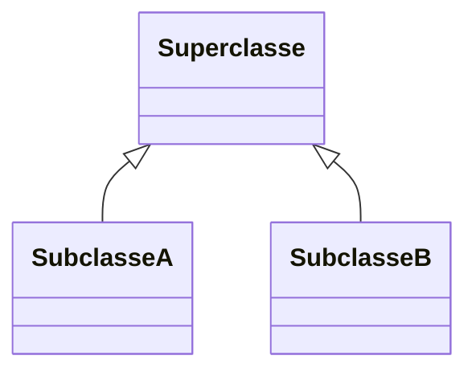
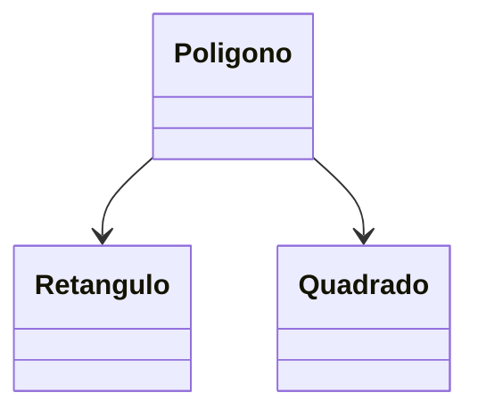
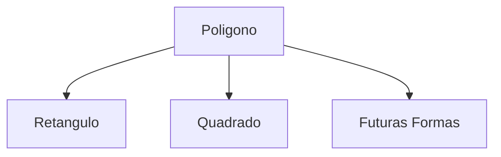

# LSP - Liskov Substitution Principle (Princípio da Substituição de Liskov)

## Visão Geral da Seção

Nesta seção do curso, o foco é o **Liskov Substitution Principle (LSP)**, ou **Princípio da Substituição de Liskov**, um dos princípios do SOLID.

A ideia principal do LSP é:

> Uma classe filha deve poder substituir sua classe pai sem alterar o comportamento esperado do sistema.

A seçaõ utiliza o exemplo clássico de:

* `Retângulo`
* `Quadrado`

Esse exemplo é importante porque mostra que:

* Nem toda relação válida no mundo real funciona corretamente em **Programação Orientada a Objetos (POO)**
* Uma herança pode parecer correta matematicamente, mas ainda assim violar boas práticas de software.

## Aula 23 - Iniciando o Projeto Polígonos

### Objetivo da Aula 23

Preparar o ambiente do projeto que será usado para demonstrar o LSP na prática.

O instrutor cria um projeto simpes em PHP utilizando:

* Composer
* Autoload PSR-4
* Estrutura básica de aplicação orientada a objetos

### Estrutura Inicial do Projeto

```text
app_poligonos/
│
├── src/
├── vendor/
├── composer.json
└── index.php
```

### Conceitos Importantes da Aula

#### 1. Composer

O Composer é o gerenciador de dependências do PHP.

Foi usado para:

* criar o projeto
* gerar autoload
* organizar namespaces

#### 2. PSR-4

PSR-4 é um padrão de autoload.

Ele define como classes são localizadas automaticamente.

Exemplo:

```json
"autoload": {
    "psr-4": {
        "AppPoligonos\\": "src/"
    }
}
```

Isso significa:

```text
Namespace: AppPoligonos\
Diretório: src/
```

### Fluxo da Inicialização do Projeto



### Conceito Fundamental Introduzido

O instrutor começa a preparar o aluno para entender:

> “Tipagem forte de comportamento”

Ou seja:

Não basta a classe “parecer correta”.

Ela precisa:

* manter o comportamento esperado
* respeitar contratos
* funcionar corretamente quando substituída

## Aula 24 - Projeto Polígonos — Retângulo e Quadrado

### Objetivo da Aula 24

Criar as classes:

* `Retangulo`
* `Quadrado`

Inicialmente utilizando herança.

### Ideia Matemática

Na matemática:

```text
Todo quadrado é um retângulo.
Mas nem todo retângulo é um quadrado.
```

Então aparentemente faria sentido:



### Classe Retângulo

A classe possui:

#### Atributos

* largura
* altura
  
#### Métodos

* getters
* setters
* cálculo da área

### Fórmula da Área

$A = \text{largura} \times \text{altura}$

### Comportamento Esperado

#### Retângulo

```text
largura = 10
altura = 5

área = 50
```

### Classe Quadrado

O quadrado herda de retângulo:


Mas existe um detalhe:

#### Quadrado possui lados iguais

Então o instrutor sobrescreve:

* `setAltura()`
* `setLargura()`

### Conceito de Polimorfismo

Polimorfismo é:

> Alterar o comportamento herdado de uma classe pai.

### Problema Criado

Quando:

```php
setLargura(10)
```

A classe Quadrado faz:

```text
altura = 10
largura = 10
```

Ou seja:

* altera dois atributos ao mesmo tempo
* muda o comportamento original da classe pai

### Fluxo do Comportamento



### Resultado

A área do quadrado passa a funcionar corretamente.

Mas um problema conceitual foi introduzido.

## Aula 25 - Projeto Polígonos — Testando a Substituição de Tipos

### Objetivo da Aula 25

Demonstrar na prática a violação do LSP.

### Teste Principal

O instrutor faz:

```php
$retangulo = new Quadrado();
```

Ou seja:

> usar um Quadrado no lugar de um Retângulo.

#### O que deveria acontecer?

Se o LSP estivesse correto:

```text
altura = 5
largura = 10

área esperada = 50
```

#### O que realmente acontece?

Resultado:

```text
100
```

#### Por quê?

Porque o comportamento foi alterado.

Quando:

```php
setLargura(10)
```

o Quadrado automaticamente faz:

```text
altura = 10
```

Então:

```text
10 x 10 = 100
```

### Violação do LSP

#### O problema não é matemático

Matematicamente:

```text
Quadrado é um retângulo
```

está correto.

#### O problema é comportamental

Programaticamente:

```text
Quadrado NÃO pode substituir Retângulo
```

sem alterar o comportamento esperado.

### Fluxo da Violação



### Grande Aprendizado da Aula

O instrutor mostra que:

#### Programação orientada a objetos não depende apenas do mundo real

Também depende:

* de comportamento
* contratos
* previsibilidade
* consistência

## Aula 26 - Entendendo o Liskov Substitution Principle

### Origem do LSP

Criado por:

* Barbara Liskov
* Jeannette Wing

em 1993.

### Definição Formal

> Se q(x) é verdadeiro para objetos do tipo T, então q(y) deve ser verdadeiro para objetos do subtipo S.

#### Tradução Simplificada

Se:

```text
Quadrado herda de Retângulo
```

Então:

```text
Quadrado deve funcionar como Retângulo
```

sem quebrar comportamento.

### Conceito Principal

#### Subtipagem forte de comportamento

O subtipo:

* não pode alterar regras essenciais
* não pode surpreender o sistema
* deve manter o contrato da superclasse

### Estrutura Conceitual



### O que o LSP tenta evitar?

#### Sistemas imprevisíveis

Quando subclasses:

* mudam comportamento
* quebram contratos
* produzem resultados inesperados

### Exemplo Correto de LSP

```text
Animal
 ├── Cachorro
 └── Gato
```

Se ambos implementam:

```text
emitirSom()
```

cada um pode ter um som diferente,
mas o comportamento esperado continua válido.

### Exemplo Incorreto

```text
Retangulo
 └── Quadrado
```

Porque o Quadrado muda regras fundamentais do Retângulo.

## Aula 27 - Refactoring do Projeto — Aplicando o LSP

### Objetivo da Aula 27

Corrigir a arquitetura do sistema.

### Primeira Correção

Remover herança:

```php
class Quadrado extends Retangulo
```

### Nova Estrutura

Agora:

* Quadrado é independente
* Retângulo é independente

### Nova Organização



### Classe Polígono

O instrutor cria:

```text
Poligono
```

Ela passa a:

* receber qualquer forma
* calcular área
* abstrair comportamento comum

### Benefícios Obtidos

#### 1. LSP respeitado

Não há mais substituição inválida.

#### 2. SRP aplicado

Cada classe possui responsabilidade única.

| Classe    | Responsabilidade           |
| --------- | -------------------------- |
| Retangulo | comportamento de retângulo |
| Quadrado  | comportamento de quadrado  |
| Poligono  | abstração geral            |

#### 3. OCP aplicado

O sistema agora aceita expansão.

Novas formas podem ser adicionadas:

* Triângulo
* Círculo
* Trapézio

sem alterar código existente.

### Fluxo Final do Projeto



## Conclusão da Seção

### 1. Nem toda herança faz sentido

Mesmo que:

* matematicamente correta
* semanticamente correta

### 2. O mais importante é o comportamento

Orientação a Objetos não trata apenas de:

* atributos
* herança
* reutilização

Ela trata principalmente de:

* contratos
* consistência
* previsibilidade

### 3. O LSP protege a arquitetura

Ele evita:

* subclasses problemáticas
* comportamento imprevisível
* acoplamento incorreto
* bugs difíceis de detectar

## Resumo Final da Seção

| Conceito         | Explicação                                                         |
| ---------------- | ------------------------------------------------------------------ |
| LSP              | subclasses devem substituir superclasses sem quebrar comportamento |
| Violação do LSP  | quando a subclasse altera regras fundamentais                      |
| Polimorfismo     | alteração de comportamento herdado                                 |
| Subtipagem forte | contratos precisam ser mantidos                                    |
| Refatoração      | remover herança inadequada                                         |
| Resultado        | sistema mais previsível e extensível                               |