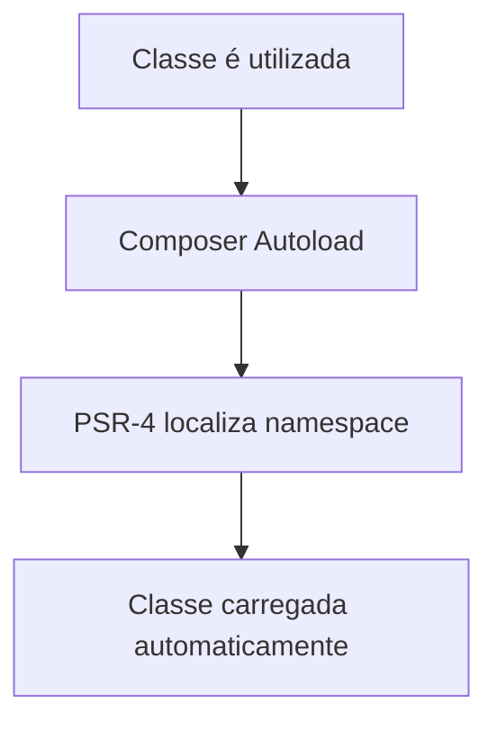
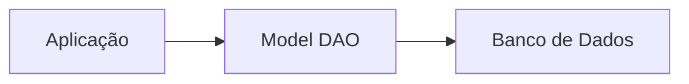
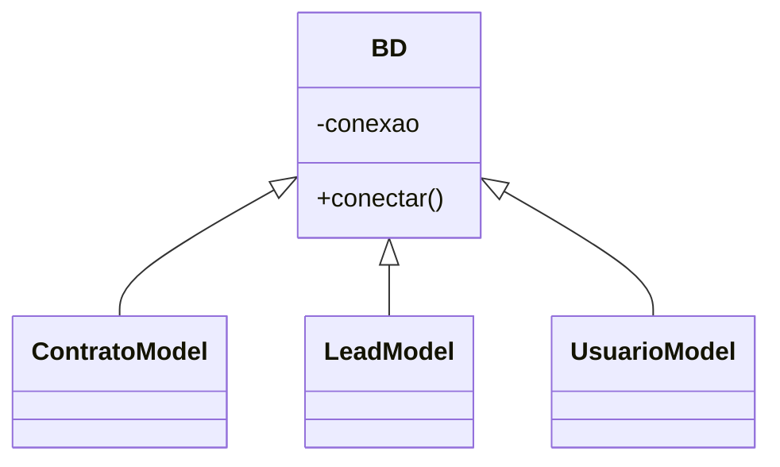
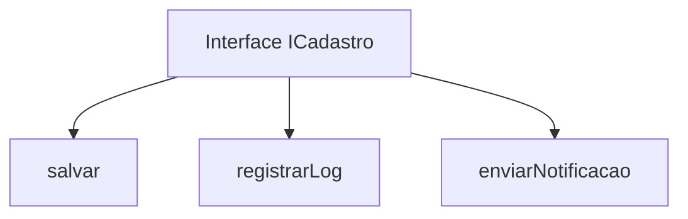
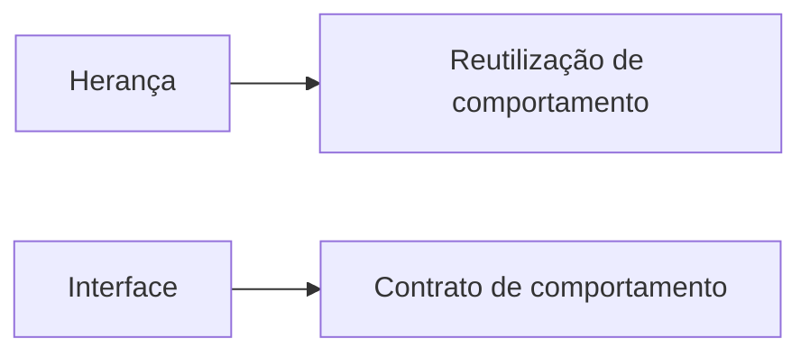
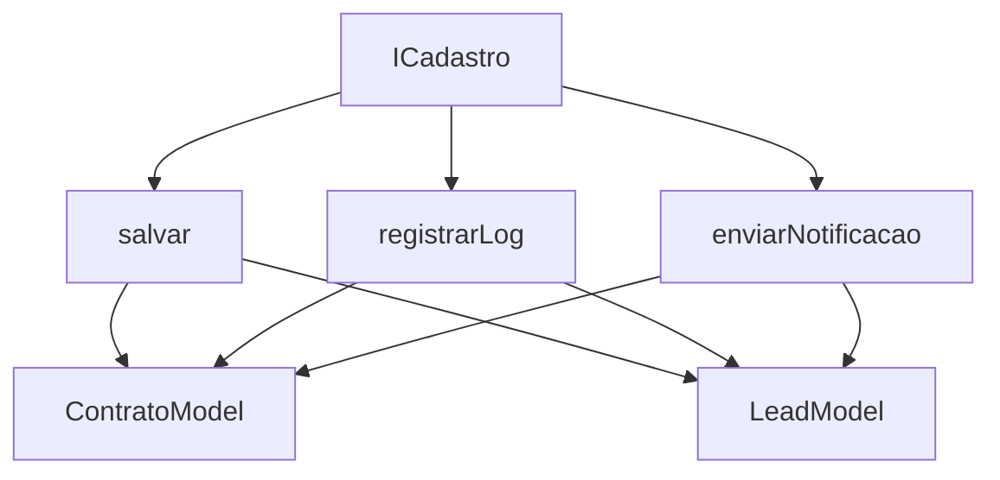
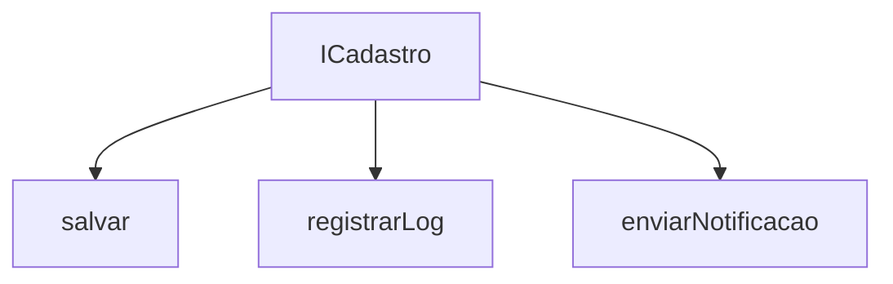
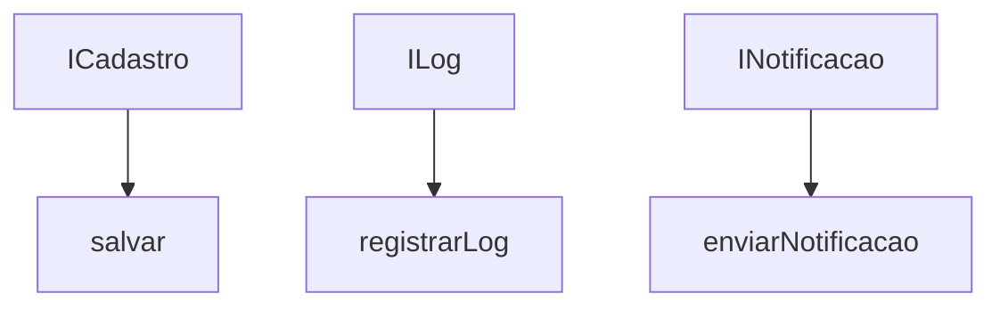
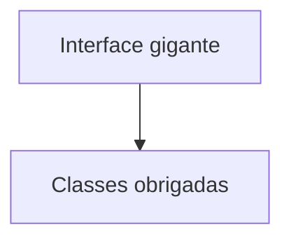
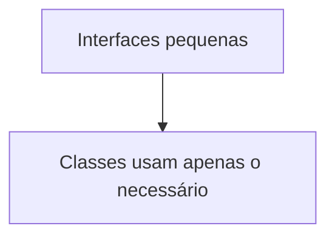

# Seção 6: ISP - Interface Segregation Principle (Princípio da Segregação de Interface)

## Objetivo da Seção

Nesta seção do curso, o foco é compreender o quarto princípio do SOLID:

* **ISP — Interface Segregation Principle**
* Em português: **Princípio da Segregação de Interface**

A ideia principal do ISP é:

> “Clientes não devem ser forçados a depender de métodos que não utilizam.”

No contexto da programação orientada a objetos:

* “Clientes” = classes que implementam interfaces.
* O problema acontece quando uma interface possui métodos demais, obrigando classes a implementarem comportamentos que elas não precisam.

A seção utiliza um projeto CRM fictício chamado `app_crm` para demonstrar isso na prática.

## Visão Geral do Projeto CRM

O projeto foi criado apenas para exemplificar o ISP.

Ele utiliza:

* Composer
* Autoload PSR-4
* Estrutura orientada a objetos
* Separação por responsabilidades

Estrutura inicial:

```text
app_crm/
├── src/
├── vendor/
├── composer.json
└── index.php
```

## Aula 28 — Iniciando o Projeto CRM

### Objetivo da Aula 28

Preparar o ambiente do projeto antes de trabalhar o ISP.

### Conceitos apresentados

#### 1. Composer

O Composer é o gerenciador de dependências do PHP.

Ele é responsável por:

* organizar dependências
* gerar autoload
* estruturar o projeto

Comando usado:

```bash
php ../composer.phar init
```

#### 2. Autoload PSR-4

O projeto utiliza o padrão PSR-4 para carregamento automático das classes.

Configuração:

```json
"autoload": {
  "psr-4": {
    "AppCrm\\": "src/"
  }
}
```

Isso significa:

| Namespace | Diretório |
| --------- | --------- |
| `AppCrm\` | `src/`    |

Exemplo:

```php
AppCrm\dao\ContratoModel
```

será procurado em:

```text
src/dao/ContratoModel.php
```

**Fluxo de funcionamento do autoload**



#### 3. Arquivo index.php

O arquivo inicial da aplicação carrega o autoload:

```php
require __DIR__ . '/vendor/autoload.php';
```

Isso permite usar classes sem precisar de vários `require`.

#### 4. Servidor embutido do PHP

Comando:

```bash
php -S localhost:8000
```

Cria um servidor local para testar o projeto no navegador.

## Aula 29 — Implementando os Componentes da Aplicação

### Objetivo da Aula 29

Criar a estrutura do CRM antes de aplicar o ISP.

Nesta etapa:

* ainda NÃO existe interface
* o objetivo é preparar o cenário

### Conceitos importantes

#### 1. Componentes da aplicação

Foram criadas classes representando entidades do sistema:

```text
componentes/
├── Contrato.php
├── Lead.php
├── Usuario.php
├── Log.php
└── Notificacao.php
```

Essas classes representam objetos do domínio.

Exemplo:

| Classe      | Representa          |
| ----------- | ------------------- |
| Contrato    | contratos           |
| Lead        | potenciais clientes |
| Usuario     | usuários do sistema |
| Log         | registros de ações  |
| Notificacao | notificações        |

#### 2. DAO — Data Access Object

Foi introduzido o conceito de DAO.

As classes:

```text
ContratoModel
LeadModel
UsuarioModel
```

funcionam como camada de acesso ao banco.

Responsabilidades:

* salvar dados
* buscar registros
* atualizar objetos

**Fluxo DAO**



#### 3. Herança

Os models herdam da classe `BD`.

```php
class ContratoModel extends BD
```

A ideia é reutilizar a lógica de conexão.

### Classe BD

Responsável pela conexão com banco:

```php
class BD {
    private $conexao;

    public function conectar() {
        // lógica
    }
}
```

### Conceito importante: Herança

Herança representa:

> especialização de comportamento

Os models passam a herdar:

* atributos
* métodos
* lógica de conexão

#### Diagrama da herança



## Aula 30 — Implementando a Interface

Agora começa o foco real do ISP.

### O que é uma Interface?

Uma interface é um contrato.

Ela define:

* O QUE deve existir
* NÃO COMO implementar

#### Interface criada

```php
interface ICadastro {
    public function salvar();
    public function registrarLog(Log $log);
    public function enviarNotificacao(Notificacao $notificacao);
}
```

### Conceitos fundamentais

#### 1. Contrato

Quando uma classe implementa uma interface:

```php
class ContratoModel implements ICadastro
```

ela é obrigada a implementar TODOS os métodos.

**Fluxo da interface**



#### 2. Diferença entre Herança e Interface

**Herança**

Representa:

> “é um tipo de”

Exemplo:

```text
ContratoModel é um BD
```

---

**Interface**

Representa:

> “é capaz de fazer”

Exemplo:

```text
LeadModel é capaz de salvar
LeadModel é capaz de notificar
```

**Comparação visual**



#### 3. Obrigatoriedade de implementação

Quando a interface foi implementada:

```php
class ContratoModel extends BD implements ICadastro
```

o PHP passou a exigir:

* salvar()
* registrarLog()
* enviarNotificacao()

Caso contrário:

* erro fatal

### O Problema Encontrado

Aqui surge o problema central da seção.

#### ContratoModel realmente precisava de:

```php
salvar()
```

Mas foi obrigada a implementar também:

```php
registrarLog()
enviarNotificacao()
```

mesmo sem utilizar esses métodos.

### O mesmo aconteceu com LeadModel

Ela precisava:

```php
salvar()
enviarNotificacao()
```

Mas foi obrigada a implementar:

```php
registrarLog()
```

desnecessariamente.

### Diagrama do problema



Observe:

* métodos inúteis foram impostos às classes

Isso viola o ISP.

## Aula 31 — Entendendo o ISP

Agora o curso entra na teoria formal.

### Definição oficial do ISP

> Clientes não devem ser forçados a depender de métodos que não usam.

### Significado prático

Interfaces muito grandes causam:

* acoplamento desnecessário
* código inchado
* baixa coesão
* implementações inúteis

### Conceitos fundamentais da aula

#### 1. Baixo Acoplamento

Baixo acoplamento significa:

> menos dependências desnecessárias

Quanto menos uma classe depender de coisas inúteis:

* mais flexível ela será
* mais fácil será modificar o sistema

#### 2. Alta Coesão

Alta coesão significa:

> cada componente faz apenas o que realmente pertence à sua responsabilidade

### Comparação

| Problema          | Solução ISP                |
| ----------------- | -------------------------- |
| Interface gigante | Interfaces específicas     |
| Métodos inúteis   | Apenas métodos necessários |
| Alto acoplamento  | Baixo acoplamento          |
| Baixa coesão      | Alta coesão                |

## Aula 32 — Refatorando e Aplicando o ISP

Agora ocorre a correção da arquitetura.

### Estratégia utilizada

A interface grande:

```php
ICadastro
```

foi dividida em interfaces menores.

### Novas interfaces

#### ICadastro

Responsável apenas por salvar:

```php
interface ICadastro {
    public function salvar();
}
```

#### ILog

Responsável apenas por log:

```php
interface ILog {
    public function registrarLog(Log $log);
}
```

#### INotificacao

Responsável apenas por notificações:

```php
interface INotificacao {
    public function enviarNotificacao(Notificacao $notificacao);
}
```

### Resultado Arquitetural

#### Antes

Uma interface gigante:



#### Depois

Interfaces pequenas e específicas:



---

### Aplicação nas classes

#### ContratoModel

Precisa apenas salvar:

```php
implements ICadastro
```

#### LeadModel

Precisa:

* salvar
* notificar

```php
implements ICadastro, INotificacao
```

#### UsuarioModel

Precisa:

* salvar
* registrar log
* notificar

```php
implements ICadastro, ILog, INotificacao
```

## Resultado Final

### Antes da refatoração



### Depois da refatoração



## Principal Aprendizado da Seção

### O ISP ensina que

Interfaces devem ser:

* pequenas
* específicas
* coesas
* focadas em responsabilidades únicas

## Benefícios obtidos

### 1. Menor acoplamento

As classes dependem apenas do necessário.

### 2. Maior organização

Cada interface possui responsabilidade clara.

### 3. Melhor manutenção

Alterações afetam menos partes do sistema.

### 4. Melhor reutilização

Interfaces pequenas são mais reutilizáveis.

## Resumo Final da Seção

### Problema inicial

Uma única interface:

```text
ICadastro
```

obrigava classes a implementar métodos inúteis.

### Solução ISP

Separar em interfaces menores:

* ICadastro
* ILog
* INotificacao

## Ideia Central do ISP

> “Nenhuma classe deve ser obrigada a implementar comportamentos que não utiliza.”

## Conclusão conceitual

O ISP promove:

* baixo acoplamento
* alta coesão
* especialização de responsabilidades
* código mais limpo
* arquitetura mais flexível

Ele trabalha diretamente na qualidade do design orientado a objetos.