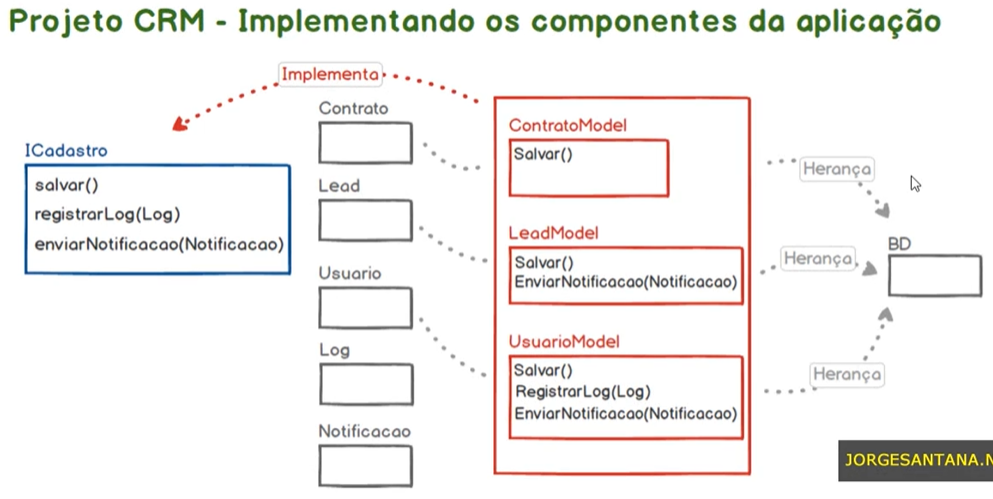

# Seção 6: ISP - Interface Segregation Principle (Princípio da Segregação de Interface)

* Princípio SOLID:
  * Interface Segregation Principle ou Princípio da Segregação de Interface ou ISP
* Nome do projeto:
  * `app_crm`
* O projeto utiliza:
  * Composer
  * Autoload PSR-4
  * Estrutura básica de aplicação orientada a objetos

## 28. Iniciando o Projeto CRM

Nesta aula, vamos criar o Projeto CRM. Antes de entrarmos na parte de teória e prática do princípio ISP, vamos iniciliar o projeto, o qual será utilizado para praticar esse princípio.

* Estrutura Inicial do Projeto:

```text
solid/
└── app_crm/
    │
    ├── src/
    ├── vendor/
    ├── composer.json
    └── index.php
```

Iniciar o projeto atráves do Composer: `php ../composer.phar init`

* Package name - teclar enter (pular)
* Description - teclar enter (pular)
* Author - teclar enter (pular)
* Minium Stability - teclar enter (pular)
* Package Type - teclar enter (pular)
* License - teclar enter (pular)
* Definição de dependências: no
* Definição de desenvolvimento: no
* Gerar arquivo: yes
* Abrir o diretório na IDE Visual Studio Code
* No arquivo composer.json, configurar o autoload com PSR-4

**app_crm/composer.json**

json
{
    "name": "julia/app_crm",
    "autoload": {
        "psr-4": {
            "AppCrm\\": "src/"
        }
    },
    "authors": [
        {
            "name": "JuhMaran",
            "email": "julianemaran@gmail.com"
        }
    ],
    "require": {}
}

* Instalação do Composer: `php ../composer.phar install`

Após as configurações iniciais, vamos criar no diretório `app_crm/` o arquivo `index.php`. Adicionar o `require` do `autoload` do composer. E adicionar `echo` com a mensagem `'Teste ISP'` para verificar se está tudo OK.

```php
<?php

require __DIR__ . '/vendor/autoload.php';

echo 'Teste ISP';
```

Na linha de comando, no diretório `app_crm`, executar o comando: `php -S localhost:8000`. E acessar o navegador e verificar no endereço `http://localhost:8000/` se retorna a mensagem. Retornou e está funcionando corretamente.

```text
Teste ISP
```

O projeto está iniciando. Até a próxima aula.

## 29. Projeto CRM - Implementando os Componentes da Aplicação



**Explicação do Slide:** Nessa aula nós daremos continuidade ao desenvolvimento do projeto CRM. Nós vamos trabalhar na construção de alguns componentes da nossa aplicação que ainda não estão diretamente relacionados com o ISP Interface Segregation Principle. Ou seja, vamos apenas estruturar a nossa aplicação para que na próxima aula seja possível entendermos como podemos aplicar o ISP quando estamos trabalhando com interfaces. Nessa aula, portanto, nós não vamos implementar a interface, vamos apenas criar os componentes básicos para começar os nossos testes.

**No código:**

* Criar o diretório `componentes` dentro do diretório `src/`.
* No diretório `src/componentes/`, vamos criar os componentes:
  * `Contrato.php`
  * `Lead.php`
  * `Usuario.php`
  * `Log.php`
  * `Notificacao.php`

Arquivos criados, vamos apenas escrever as classes. Lembrando que não faremos a implementação do CRM em si. Vamos apenas criar alguns componentes e classes para inlustrar melhor o ISP.

* Definir o `namespace` como sendo `AppCrm\componentes;`

Vamos criar as classes:

* ContratoModel
* LeadModel
* UsuarioModel

Essas classes teriam como responsabilidade recuperar os respectivos objetos (Contrato, Lead e Usuario) e manipular esses objetos junto ao banco de dados. Ou seja, aqui teríamos uma interface DAO (Data Access Object), para manipular os objetos da nossa aplicação junto ao banco isolando a responsabilidade desses objetos.

**Sugestão do instrutor:** pesquisar sobre DAO (Data Access Object) para complementar os estudos.

Essas classes Model, vamos criar em outro diretório do projeto. Então, dentro de `src/`, vamos criar um diretório chamado `dao/` e dentro dele vamos criar:

* `ContratoModel.php`
* `LeadModel.php`
* `UsuarioModel.php`

Todas essas classes extenderão a classe BD (banco de dados) que ainda será criada. Vamos definir as classes dentro dos arquivos que nós criamos dentro do diretório `dao/`. Fechar todas as classes e facilitar o entendimento do que estamos fazendo. E dentro do diretório `src/`, vamos criar um script chamado `BD.php`. Essa classe deve ter:

* Um atributo privado de conexão com o banco de dados: `private $conexao;`
* Um método para estabelecer a conexão com o banco de dados: `conectar()`
* Adicionar a lógica
* Ao executar o método `conectar()` uma conexão com o banco de dados seria estabelecida
* Essa conexão (resource) seria atribuído a variável `conexao` da classe `BD.php`
* Adicionar o `namespace`

Os nossos model podem extender a classe `BD.php` para herdar essa característica de conexão. Já que são as classes model que manipulam os respectivos objetos no banco de dados. Em cada um dos models vamos dar `use AppCrm\BD;` para extender essa classe. Adicionar nas classes `ContratoModel`, `LeadModel` e `UsuarioModel`. Feito isso nós já temos aqueles objetos pra começar a testar o ISP. Mas antes de começar a fazer esses testes antes de implementar a interface que vai ser o alvo de um entendimento a respeito do que é o ISP vamos apenas fazer alguns testes aqui na nossa aplicação. Agora que os modelos extenderam a classe DB, que por sua vez possui a lógica de conexão com o banco. No arquivo `index.php` vamos incluir o `use` de cada um dos modelos.

```php
use AppCrm\dao\ContratoModel;
use AppCrm\dao\LeadModel;
use AppCrm\dao\UsuarioModel;
```

Adicionar o atributo `$contratoModel` e verificar se está instanciando corretamente.

```php
$contratoModel = new ContratoModel();
print_r($contratoModel);
echo '<br>';

// fazer o mesmo com LeadModel e UsuarioModel
```

Retorno via navegador:

```text
AppCrm\dao\ContratoModel Object ( [conexao:AppCrm\BD:private] => )
AppCrm\dao\LeadModel Object ( [conexao:AppCrm\BD:private] => )
AppCrm\dao\UsuarioModel Object ( [conexao:AppCrm\BD:private] => )
```

Os três objetos foram recuperados corretamente e estendem a classe BD, portanto herdam os atributos e métodos. Como dito anteriormente, nós montamos apenas os componentes da nossa aplicação, para começar a usar esses componentes desses objetos dentro de um contexo que faça sentindo a utilização de uma interface para nós estudarmos a fundo o ISP. Até a próxima aula.

## 30. Projeto CRM - Implementando a Interface

Na aula anterior nós trabalhamos na criação de diversas classes dentro do nosso projeto. Nessa aula nós vamos focar na criação da interface e cadastro e na implementação dessa interface nas classes ContratoModel, LeadModel e UsuarioModel. A ideia é que após a implementação dessa interface nessas classes seja possível entender claramente qual é a proposta do ISP. Ou seja, como que o Interface Segregation Principle sugere que trabalhamos com interfaces dentro dos nossos códigos. Ok. Bom um detalhe importante é que diferente das classes as interfaces elas não implementam os métodos elas apenas definem a assinatura daqueles respectivos métodos e as interfaces funcionam como uma espécie de contrato quando uma classe implementa uma determinada interface ela obrigatoriamente precisa implementar os métodos que foram definidos dentro dessa respectiva Interface. Então repare que a relação de uma classe para com uma interface é bem diferente da relação de herança. A herança é a especialização de um tipo, é quando pegamos uma determinada classe e estendemos essa classe especializando seus comportamentos. Já a interface é uma espécie de contrato que pode ser associada a várias classes de domínios distintos para que os respectivos métodos dessa interface obrigatoriamente sejam implementados dentro dessas classes. Bom vamos ao código. Eu tenho certeza que tudo isso ficará bem mais claro. Voltava aqui no nosso código dentro do diretório `src`. Vou criar um novo diretório chamado `interfaces/` e dentro deste diretório, vou criar um script de `ICadastro.php` que será nossa interface. Vou definir o `namespace AppCrm\interfaces;`, e para declarar vamos utilizar a palavra reservada `interface` seguida do nome `ICadastro {}`. A síntaxe é semelhante a de uma classe. Vamos determinar os métodos que as classes obrigatoriamente precisaram implementar. Dentro de uma interface todos os métodos são públicos, então teremos os métodos `salvar()`, `registrarLog(Log)` e `enviarNotificacao(Notificacao)`. Repare que nós apenas definimos aqui a assinatura do método. Nós não estamos implementando novamente a responsabilidade de implementação é da classe que implementar aquela respectiva interface. E ao retornar ao slide, podemos observar que nossa interface espera receber registrar Log, um objeto do tipo Log e para enviar notificação espera um objeto do tipo notificação. Essas classes Log.php e Notificacao.php foram criadas na aula anterior, que definem esses objetos. Então nós vamos importar aqui pra assinar os métodos como objetos desse tipo (`use AppCrm\componentes\Log;` e `use AppCrm\componentes\Notificacao;`). E na assinatura dos métodos, vamos tipar o parâmetro, espero receber uma variável (`$log`) do tipo `Log` e o mesmo para notificação (`enviarNotificacao(Notificacao $notificacao)`). Importamos as classes Log e Notificacao, portanto temos um tipo de dado que podemos utilizar para tipar o parâmetro, que desejamos receber em cada método. Então, estamos definindo um contrato dentro da nossa aplicação que determina que a classe que implementar essa interface, obrigatoriamente, precisa implementar esses três métodos. O próximo passo é implementar essa interface nas classes que receberão esses contratos. Iniciando pelo `ContratoModel.php`:

```php
<?php
namespace AppCrm\dao;
use AppCrm\BD;
use AppCrm\interfaces\ICadastro;
use AppCrm\componentes\Log;
use AppCrm\componentes\Notificacao;
class ContratoModel extends BD { }
```

Essa interface então começando pelo contrato do módulo eu vou abrir por aqui só pra facilitar um pouco olha só as três classes que estamos falando que elas estão aqui. Vital então contrato modo para implementar essa interface bem simples basta dar um série C Barra interfaces se você se lembra bem nós definimos esse nome espécie aqui olha só criamos o diretório interfaces aqui dentro de SC. Então aqui basta utilizar uma interfaces com interfaces se não faz cadastro Ok pra implementar essa interface bem simples aquela só na classe. Nós estamos estendendo da classe BD, mas nada impede que ao mesmo tempo a gente faça a implementação da interface cadastro no momento em que isso é feito olha só o que acontece. Você sabe que eu ainda vou comentar com o nosso objeto que é o nosso objeto Usuário. Vou isolar aqui apenas o objeto do contrato e aí só pra testar.

```php
<?php
namespace AppCrm\dao;
use AppCrm\BD;
use AppCrm\interfaces\ICadastro;
use AppCrm\componentes\Log;
use AppCrm\componentes\Notificacao;
class ContratoModel extends BD implements ICadastro { }
```

Vou alterar aqui no contrato vou fazer o seguinte vou tirar aqui temporariamente essa instrução vou salvar vou voltar aqui no browser vou atualizar está lá o nosso contrato está funcionando mas no instante em que a implementação da interface é feita olha só a linguagem na tela passa a obrigar a implementação dos métodos contidos nessa interface Então repare que o PHP diz pra gente que existem 3 métodos abstratos que foram declarados na interface mas não foram implementados na classe que faz uso da respectiva interface. Os métodos são salvar, registrar logs e enviar a notificação para resolver esse problema. Basta aqui na classe que implementa a interface e implementar os métodos. Então `public function salvar()`. E aqui nós teríamos uma lógica lembrando que eu não vou implementar a lógica ao longo desse projeto porque senão ficaria muito extenso. Então olha só. Ao fazer isso repare que ele não reclama mais tomado do salvar porque esse método foi implementado com o nosso próximo passo será implementar o método `registrarLog()`. Então voltar aqui no código. Vou copiar essas instruções, para facilitar. Legal. Observe que nós tivemos um erro aqui. Por quê. Porque o nosso método `registrarLog()` definindo na interface cadastro espera um parâmetro, um parâmetro do tipo `Log`. Portanto aqui no nosso código nós precisamos receber esse parâmetro e aí para manter o nosso código coerente vamos estipular o nosso parâmetro como sendo do tipo `Log` para fazer isso basta só importar a nossa classe `Log`, vou salvar, retornar ao browser e está lá. Repare que o erro mudou. Agora ele está reclamando de `enviarNotificacao()`. Então vamos implementar aqui o método `enviarNotificacao()`. Lembrando que a nossa interface está determinado que esse método recebe um parâmetro do tipo `Notificacao`. Então nós podemos fazer o mesmo aqui olha só bastando apenas importar a nossa classe `Notificacao` para que seja possível 'tipar' o parâmetro dessa forma. Tudo salvo. Vou voltar aqui no browser, vou atualizar tá lá. A classe `ContratoModel` voltou a funcionar normalmente porque ela implementou a interface. Nós adicionamos a interface a essa classe e implementamos os seus respectivos métodos. Mas repare que no caso da classe `ContratoModel` nós precisaríamos apenas do método `salvar()`, mas nós fomos obrigados a implementar também os métodos `registrarLog` e `enviarNotificacao`. Repare que esses dois métodos aqui eles não seriam necessários para a nossa classe `ContratoModel`, mas devido a característica de interface nós fomos obrigados a implementar esses métodos aqui também. E aí voltando no arquivo `index.php`, vou remover os comentários de `leadModel` e `usuarioModel`. Na classe `leadModel`, faremos a memsa coisa, importar a interface, importar os tipos e implementar os métodos. Lembrando que aqui neste modelo a lógica mantida dentro dos métodos poderiam ser bem diferentes da lógica contida nos métodos aqui da classe `ContratoModel` porque a interface não se preocupa com a implementação em si, apenas com a implementação de um método usando uma determinada assinatura. Então aqui repare que para `LeadModel` nós também seremos obrigados a implementar os três médicos definidos na interface.  Isso é uma regra, mas se observarmos aqui as nossas necessidades de negócio nós precisaríamos apenas dos métodos de `salvar()` e `enviarNotificacao()`. Para `LeadModel` o método `registrarLog()` precisa ser implementado de algum modo porque a interface obriga mais, a classe não necessariamente precisa desse método. Já para o `UsuarioModel` nós vamos implementar os três métodos da interface. Estávamos lá para facilitar vou copiar aqui de `LeadModel`, mesma coisa, tudo salvo se voltarmos aqui no browser e atualizar nos a página olha só a nossa aplicação está funcionando normalmente e as três classes `ContratoModel`, `LeadModel` e `UsuarioModel` estão implementando a interface `ICadastro` e portanto implementando os três métodos definidos dentro dessa interface. Como eu comentei nem todas as classes utilizam todos os métodos que são definidos na interface, mas por ser uma interface obrigatoriamente essas classes estão obrigadas a implementar esses métodos. E é justamente aqui que o ISP traz para nós uma recomendação importante que nós veremos na próxima aula. Até a próxima aula;

## 31. Entendendo a Interface Segregation Principle

Nessa aula eu vou falar sobre o quarto princípio SOLID, Interface Segregation Principle ou Princípio da Segregação de Interface ou ISP. O princípio diz que **Clientes NÃO devem ser forçados a depender de métodos que NÃO usam**. Nesse caso os clientes em questão são as classes quando uma interface é implementada em uma classe. Se você se lembra bem a classe obrigatoriamente precisa implementar todos os métodos da interface. Porém segundo o ISP é nesse ponto que precisamos ficar atentos, se a implementação dos métodos de fato faz sentido na classe. Em resumo se os métodos implementados não forem utilizados pelo objeto o que será responsável a partir da classe. Então não faz sentido implementar esses métodos. Repare que essa conclusão ela é bastante razoável, concorda? Na prática isso significa que **muitas interfaces específicas são melhores do que uma única interface**. A palavra de ordem nesse caso **baixo acoplamento** e **alta coesão** justamente para que as classes clientes não sejam forçadas a implementar métodos que não serão utilizados. Se observarmos o nosso projeto CRM que desenvolvemos em aulas anteriores podemos enxergar exatamente com o princípio ISP ferido se você se lembra bem no projeto. Nós criamos uma interface com três métodos e essa interface foi implementada em três classes distintas na `ContratoModel`, `LeadModel` e `UsuarioModel`. No instante em que a interface `ICadastro` foi implementada nessas classes as classes obrigatoriamente precisaram implementar os três métodos definidos nessa interface. Repare que isso foi obrigatório. Mesmo sabendo que algumas das classes não implementaram todos os métodos da interface. Então repare que aqui nós criamos dentro do nosso projeto uma situação que fere o ISP, porque existem clientes/classes que implementam interfaces que são forçadas a implementar os seus respectivos métodos sem que esses métodos sejam de fato utilizados. Na próxima aula nós vamos trabalhar fazendo um refactoring no nosso projeto segregando a interface, ou seja, separando as funcionalidades dessa interface definindo interfaces específicas para atendermos ao princípio ISP do SOLID, então até a próxima aula.

## 32. Refactoring do Projeto - Aplicando o Princípio na Prática


## Estrutura Final

```text
solid/
└── app_crm/
    ├── src/
    │   ├── componentes/
    │   │   ├── Contrato.php
    │   │   ├── Lead.php
    │   │   ├── Log.php
    │   │   ├── Notificacao.php
    │   │   └── Usuario.php        
    │   ├── dao/    
    │   │   ├── ContratoModel.php
    │   │   ├── LeadModel.php
    │   │   └── UsuarioModel.php
    │   ├── interfaces/
    │   │   └── ICadastro.php    
    │   └── BD.php
    ├── vendor/
    ├── composer.json
    └── index.php
```

## Código Final Implementado

* `componentes/Contrato.php`

```php
<?php
namespace AppCrm\componentes;
class Contrato {}
```

* `componentes/Lead.php`

```php
<?php
namespace AppCrm\componentes;
class Lead {}
```

* `componentes/Log.php`

```php
<?php
namespace AppCrm\componentes;
class Log {}
```

* `componentes/Notificacao.php`

```php
<?php
namespace AppCrm\componentes;
class Notificacao {}
```

* `componentes/Usuario.php`

```php
<?php
namespace AppCrm\componentes;
class Usuario {}
```

* `dao/ContratoModel.php`

```php
<?php
namespace AppCrm\dao;
use AppCrm\BD;
class ContratoModel extends BD {}
```

* `dao/LeadModel.php`

```php
<?php
namespace AppCrm\dao;
use AppCrm\BD;
class LeadModel extends BD {}
```

* `dao/UsuarioModel.php`

```php
<?php
namespace AppCrm\dao;
use AppCrm\BD;
class UsuarioModel extends BD {}
```

* `BD.php`

```php
<?php
namespace AppCrm;
class BD {
    private $conexao;
    public function conectar() {
      // add lógica
    }
}
```

* `index.php`

```php
<?php

require __DIR__ . '/vendor/autoload.php';

use AppCrm\dao\ContratoModel;
use AppCrm\dao\LeadModel;
use AppCrm\dao\UsuarioModel;

$contratoModel = new ContratoModel();
print_r($contratoModel);
echo '<br>';

$leadModel = new LeadModel();
print_r($leadModel);
echo '<br>';

$usuarioModel = new UsuarioModel();
print_r($usuarioModel);
echo '<br>';

// echo 'Teste ISP';
```

* `interfaces/ICadastro.php`

```php
<?php
namespace AppCrm\interfaces;
use AppCrm\componentes\Log;
use AppCrm\componentes\Notificacao;
interface ICadastro {
    public function salvar();
    public function registrarLog(Log $log);
    public function enviarNotificacao(Notificacao $notificacao);
}
```

* composer.json

```json
{
    "name": "julia/app_crm",
    "autoload": {
        "psr-4": {
            "AppCrm\\": "src/"
        }
    },
    "authors": [
        {
            "name": "JuhMaran",
            "email": "julianemaran@gmail.com"
        }
    ],
    "require": {}
}
```