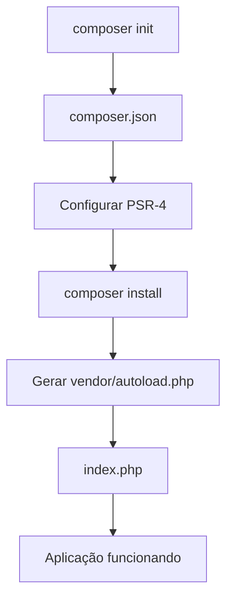
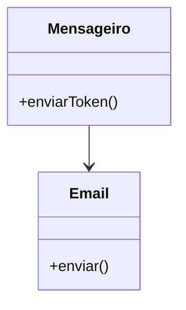
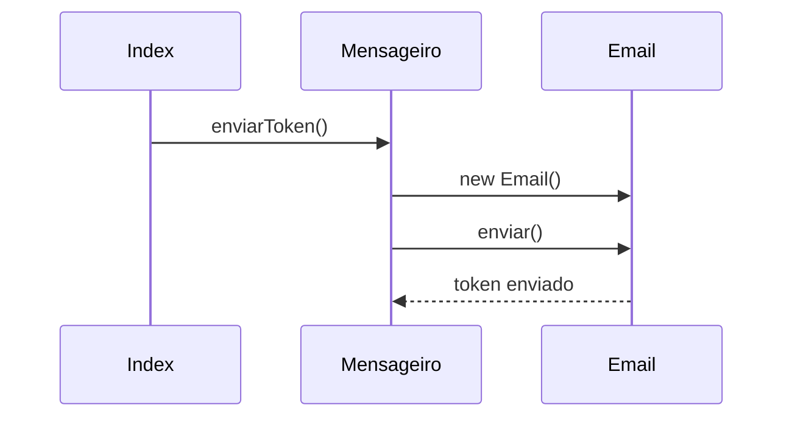
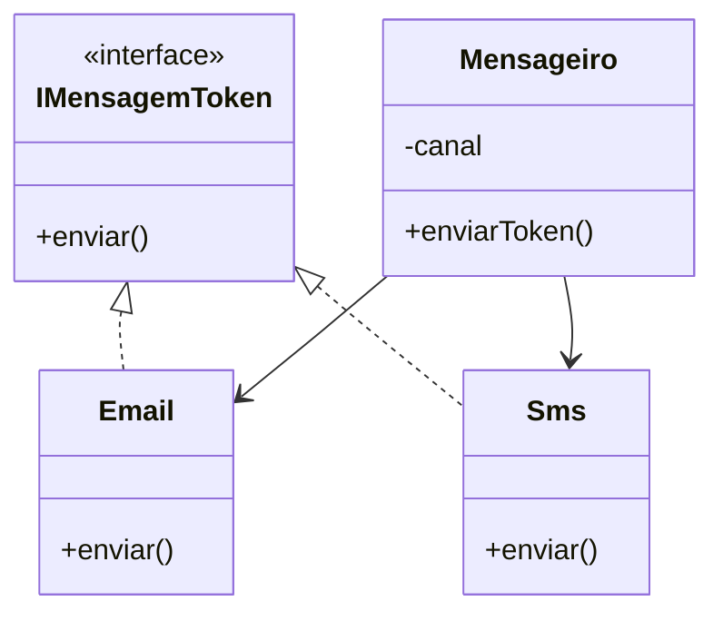
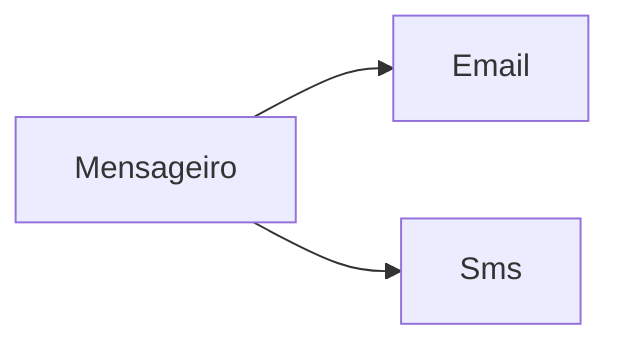
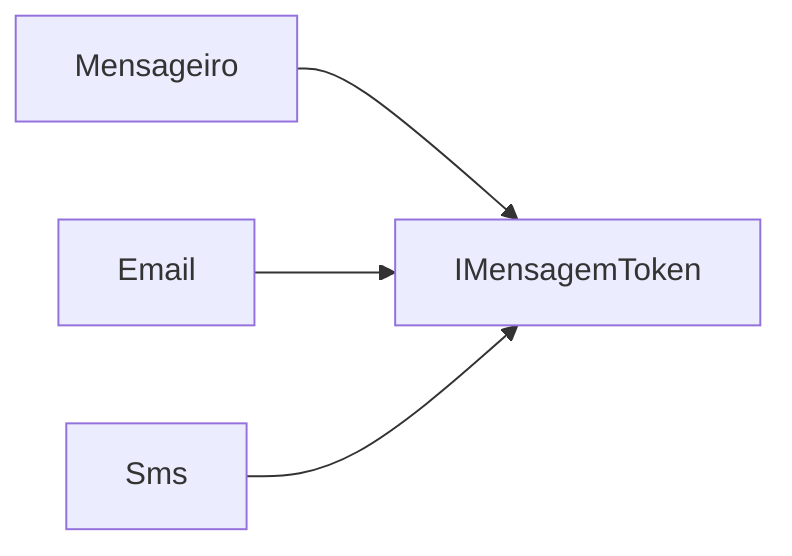
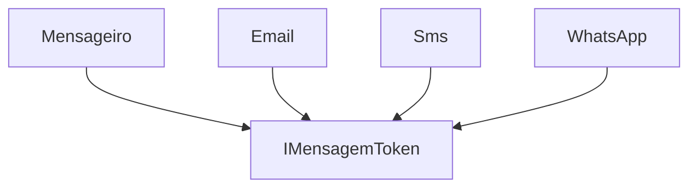
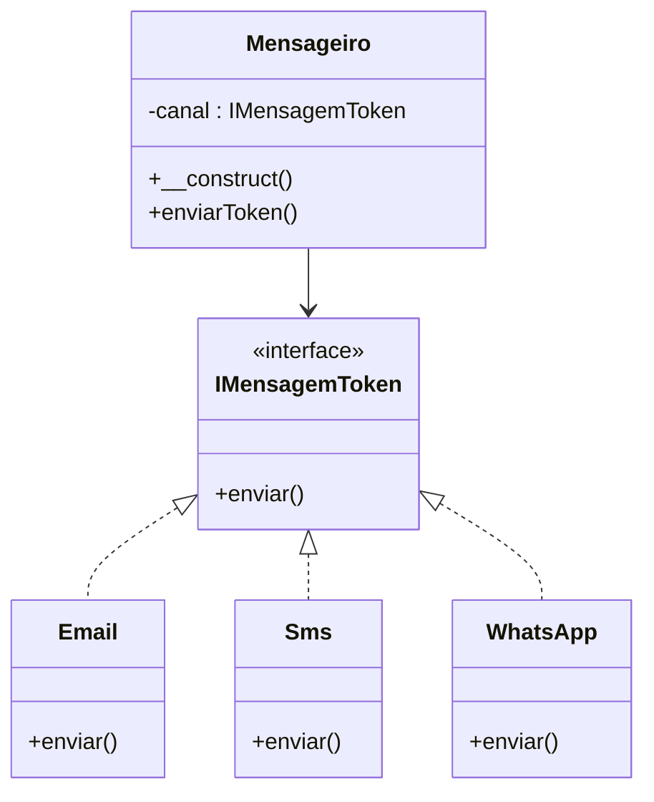
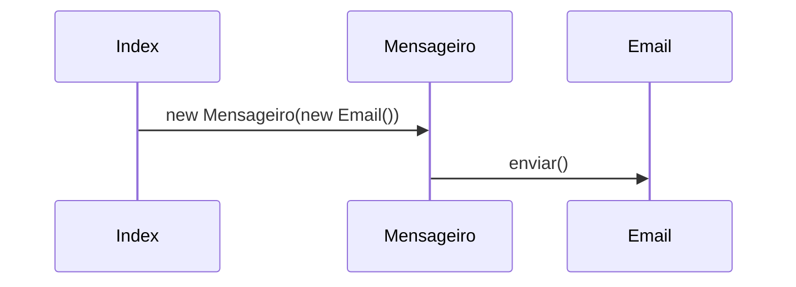
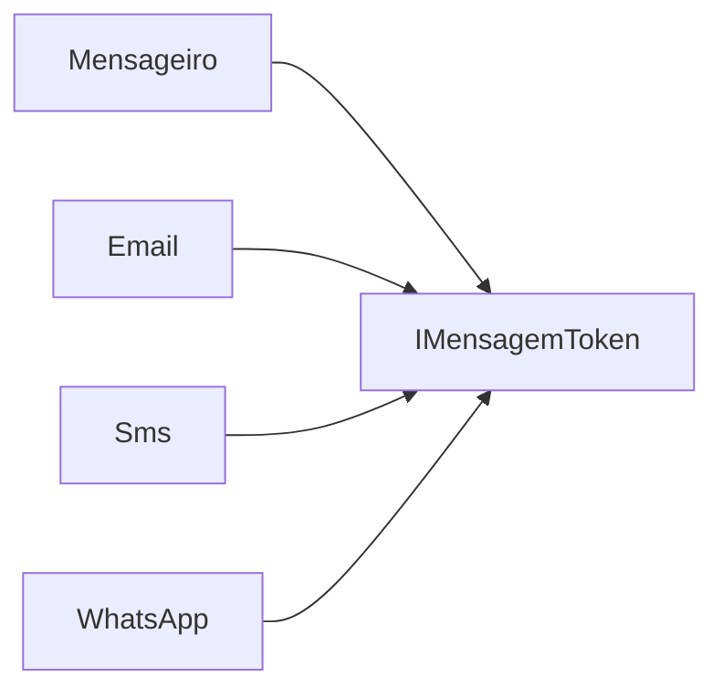

# DIP - Dependency Inversion Principle (Princípio da Inversão de Dependência)

## Objetivo da Seção

Nesta seção do curso, o foco é compreender o quinto princípio SOLID:

* **DIP — Dependency Inversion Principle**
* Em português:

  * **Princípio da Inversão de Dependência**

O curso utiliza um projeto chamado `app_mensageiro` para demonstrar:

* criação de aplicações orientadas a objetos
* organização com Composer
* autoload PSR-4
* interfaces
* abstrações
* injeção de dependência
* redução de acoplamento

O principal objetivo é mostrar:

> Como fazer classes dependerem de abstrações ao invés de implementações concretas.

## 33. Iniciando o Projeto Mensageiro

### O que foi feito nesta aula

A aula começa criando a estrutura base do projeto.

O projeto utiliza:

* PHP
* Composer
* PSR-4
* estrutura orientada a objetos

### Estrutura do projeto

```text
solid/
└── app_mensageiro/
    ├── src/
    ├── vendor/
    ├── composer.json
    └── index.php
```

### Conceitos importantes apresentados

#### 1. Composer

O Composer é o gerenciador de dependências do PHP.

Ele é usado para:

* organizar bibliotecas
* configurar autoload
* estruturar projetos modernos

Comando utilizado:

```bash
php ../composer.phar init
```

#### 2. Autoload PSR-4

O PSR-4 é um padrão de carregamento automático de classes.

Isso evita vários `require` manuais.

Exemplo:

```json
"autoload": {
    "psr-4": {
        "AppMensageiro\\": "src/"
    }
}
```

Isso significa:

| Namespace        | Diretório |
| ---------------- | --------- |
| `AppMensageiro\` | `src/`    |

### Fluxo de inicialização



### Papel do `index.php`

O `index.php` funciona como ponto de entrada da aplicação.

```php
require __DIR__ . '/vendor/autoload.php';
```

Esse trecho:

* carrega automaticamente as classes
* ativa o autoload do Composer

### Servidor embutido do PHP

Comando utilizado:

```bash
php -S localhost:8000
```

Esse comando cria um servidor local para testes.

### O que essa aula ensina na prática

A aula ensina:

* como estruturar um projeto PHP moderno
* como usar Composer
* como configurar namespaces
* como utilizar PSR-4
* como iniciar aplicações orientadas a objetos

## 34. Implementando os Componentes da Aplicação (Parte 1)

### Objetivo da aula

Criar:

* classe `Mensageiro`
* classe `Email`

A ideia é simular envio de token para autenticação.

### Conceito principal

#### Responsabilidade Única (SRP)

Cada classe possui uma responsabilidade específica.

| Classe       | Responsabilidade |
| ------------ | ---------------- |
| `Mensageiro` | coordenar envio  |
| `Email`      | enviar mensagem  |

### Estrutura criada



### Funcionamento

#### Classe `Email`

Responsável apenas pelo envio.

```php
class Email {
    public function enviar(): void {
        echo 'E-mail: Seu token é 555-333';
    }
}
```

#### Classe `Mensageiro`

Coordena o envio.

```php
$obj = new Email();
$obj->enviar();
```

Aqui nasce um ponto MUITO importante:

* `Mensageiro` depende diretamente de `Email`

Esse detalhe será essencial para entender o DIP.

### Conceito apresentado indiretamente

#### Acoplamento

Quando uma classe cria outra diretamente:

```php
new Email()
```

existe um forte vínculo entre elas.

Isso é chamado de:

* dependência direta
* forte acoplamento

### Fluxo da aplicação



### O que a aula ensina

A aula mostra:

* separação de responsabilidades
* organização orientada a objetos
* criação de dependências entre classes

Ela prepara o terreno para o problema que o DIP resolve.

## 35. Implementando os Componentes da Aplicação (Parte 2)

### Objetivo da aula

A aplicação agora passa a suportar:

* Email
* SMS

Isso torna o sistema mais flexível.

### Conceito central

## Aberto para expansão (OCP)

O sistema pode crescer sem alterar a estrutura principal.

### Nova classe: `Sms`

```php
class Sms {
    public function enviar(): void {
        echo 'SMS: Seu token é 888-333';
    }
}
```

### Problema identificado

Tanto `Email` quanto `Sms` possuem:

```php
enviar()
```

Mas nada garante isso formalmente.

### Solução: Interface

Foi criada:

```php
interface IMensagemToken {
    public function enviar(): void;
}
```

### Papel da interface

A interface funciona como um contrato.

Ela obriga todas as classes a implementarem:

```php
enviar()
```

### Estrutura após refatoração



### Uso de polimorfismo

A classe `Mensageiro` passa a trabalhar dinamicamente.

Dependendo do canal:

* usa `Email`
* usa `Sms`

### Construção dinâmica da classe

```php
$classe = 'AppMensageiro\\' . ucfirst($this->canal);
$obj = new $classe();
```

Isso permite:

* expansão futura
* novos canais
* menos alteração de código

### Conceitos aplicados

| Conceito     | Aplicação                      |
| ------------ | ------------------------------ |
| SRP          | cada classe faz uma coisa      |
| OCP          | sistema aberto para expansão   |
| LSP          | objetos podem ser substituídos |
| Interface    | contrato comum                 |
| Polimorfismo | comportamento dinâmico         |

### Mas ainda existe um problema

Mesmo usando interface:

```php
$obj = new $classe();
```

A classe `Mensageiro` ainda cria objetos internamente.

Ou seja:

* ainda existe dependência direta
* ainda existe acoplamento

Esse é exatamente o problema resolvido pelo DIP.

## 36. Entendendo o Dependency Inversion Principle

### Definição do DIP

O princípio afirma:

> Módulos de alto nível não devem depender de módulos de baixo nível. Ambos devem depender de abstrações.

### Explicação simples

## ERRADO



A classe principal depende diretamente das implementações.

#### CERTO



Agora todos dependem da abstração.

### O que é módulo de alto nível?

É a classe principal da regra de negócio.

Neste projeto:

* `Mensageiro`

### O que é módulo de baixo nível?

São classes auxiliares.

Neste projeto:

* `Email`
* `Sms`

### O problema do `new`

Sempre que aparece:

```php
new Classe()
```

dentro de outra classe:

* existe dependência forte
* existe acoplamento

### Conceito fundamental

#### Depender de abstrações

Ao invés de depender de:

```php
Email
Sms
```

o correto é depender de:

```php
IMensagemToken
```

### Abstrações podem ser

| Tipo              |
| ----------------- |
| Interfaces        |
| Classes abstratas |

### Injeção de Dependência

O curso apresenta o conceito de:

#### Dependency Injection

Ao invés da classe criar a dependência:

```php
new Email()
```

a dependência é entregue pronta.

### Tipos de injeção mostrados

| Tipo              |
| ----------------- |
| Via construtor    |
| Via getter/setter |
| Via interface     |
| Via framework     |

### Benefícios do DIP

#### 1. Baixo acoplamento

As classes ficam independentes.

#### 2. Alta flexibilidade

Novos canais podem ser adicionados facilmente.

#### 3. Melhor manutenção

Mudanças afetam menos partes do sistema.

#### 4. Melhor testabilidade

Facilita testes unitários.

### Fluxo conceitual do DIP



## 37. Refactoring Aplicando o DIP

### Objetivo da aula

Aplicar o DIP corretamente usando:

* abstração
* interface
* injeção de dependência

### Problema da versão antiga

Antes:

```php
$obj = new $classe();
```

A classe `Mensageiro` ainda criava dependências.

### Solução

A dependência passa a ser recebida externamente.

### Injeção via construtor

```php
public function __construct(IMensagemToken $canal)
```

Agora:

* `Mensageiro` depende da interface
* não depende mais de `Email` ou `Sms`

### Estrutura final



### Funcionamento da injeção

#### Antes

```php
Mensageiro cria Email
```

#### Depois

```php
Email é entregue ao Mensageiro
```

### Fluxo atualizado



### Grande vantagem

A classe `Mensageiro` não precisa conhecer:

* Email
* Sms
* WhatsApp

Ela conhece apenas:

```php
IMensagemToken
```

### Inclusão do WhatsApp

A aula mostra um exemplo importante:

```php
new Mensageiro(new WhatsApp())
```

Se `WhatsApp` NÃO implementar:

```php
IMensagemToken
```

ocorre erro.

### Isso é importante porque

O sistema passa a garantir:

* padronização
* segurança
* previsibilidade

### Conceito final da seção

#### DIP NÃO elimina dependências

Ele:

* INVERTE a direção da dependência

#### Antes


#### Depois



### Resultado final

O projeto agora possui:

| Característica       | Resultado |
| -------------------- | --------- |
| Baixo acoplamento    | Sim       |
| Alta coesão          | Sim       |
| Flexibilidade        | Sim       |
| Extensibilidade      | Sim       |
| Reuso                | Sim       |
| Facilidade de testes | Sim       |

## Resumo geral da Seção 7

### O que foi aprendido

#### Estruturação de projeto PHP

* Composer
* PSR-4
* namespaces

#### Criação de responsabilidades separadas

* Mensageiro
* Email
* Sms

#### Uso de interfaces

* contratos
* abstrações

#### Entendimento do DIP

* depender de abstrações
* evitar dependência direta
* reduzir acoplamento

#### Injeção de dependência

* dependências recebidas externamente
* injeção via construtor

#### Refatoração orientada a SOLID

A aplicação ficou:

* mais limpa
* mais flexível
* mais desacoplada
* mais preparada para crescimento
