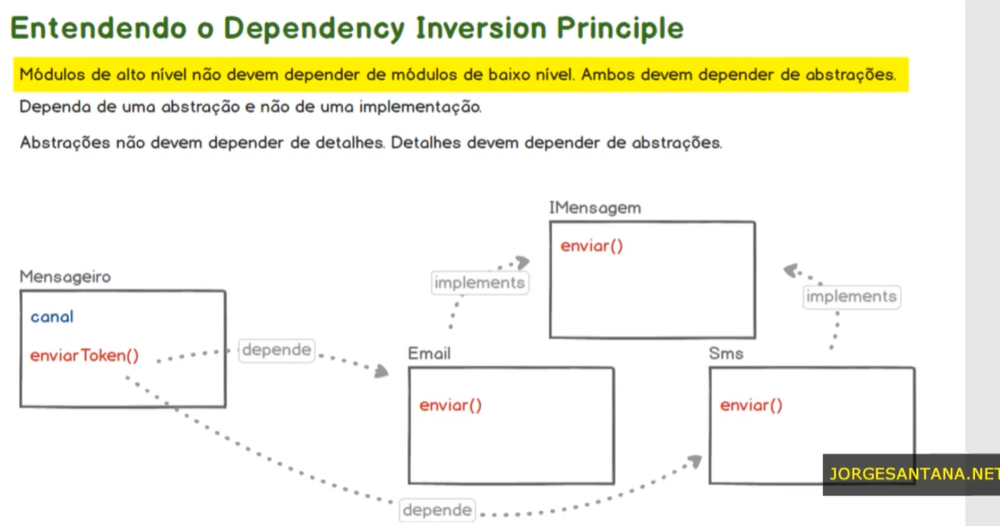

# DIP - Dependency Inversion Principle (Princípio da Inversão de Dependência)

## 33. Iniciando o Projeto Mensageiro

Muito bem dando continuidade ao estudo dos princípios SOLID. A partir dessa aula nós vamos falar sobre Dependency Inversion Principle ou em português Princípio da Inversão de Dependência ou simplesmente DIP. Mas antes de entrarmos na parte teórica e prática desse princípio nessa aula nós vamos nos concentrar na inicialização do projeto que será a base para os nossos estudos. O projeto que vamos desenvolver ao longo dessa sessão será o projeto mensageiro. Então vamos lá vou acessar o diretório `SOLID` de vou criar um novo diretório chamado `app_mensageiro`. Muito bem e aí vou copiar aqui esse endereço vamos abrir aqui no CMD e através do Composer nós vamos iniciar esse projeto vou teclar Enter, aqui para avançar na configuração do projeto aqui no autor vou colocar o meu nome e o meu contato e também vamos seguir aqui teclando a entra aqui nas configurações de instalação das dependências, vou dizer que não. E aí vamos confirmar a geração do composer.json. Na sequência vamos acessar aqui o nosso projeto através de um editor de texto de código Fontes. Vou utilizar aqui o VSCode vou adicionar esse diretório à nossa área de trabalho aqui está vamos configurar aqui no composer.json o nosso autoload. Vou criar o diretório `src`, fechar o arquivo composer.json e aqui através da linha de comando Vamos executar a instrução `php ../composer.phar install` e aí é só aguardar alguns instantes, instalação realizada com sucesso. Vamos voltar aqui no nosso projeto para criar o `index.php` que fará o required do autoload. Vamos da um `echo` na mensagem `Funcionando!`, de volta ao CMD, vamos executar o comando `php -S localhost:8000` para servir a nossa aplicação mensageiro e aí através do browser vamos acessar a aplicação instalada no nosso projeto portanto está iniciado então até a próxima aula.

* index.php

```php
<?php
require __DIR__ . '/vendor/autoload.php';
echo 'Funcionando!';
```

* composer.json

```json
{
    "name": "julia/app_mensageiro",
    "autoload": {
        "psr-4": {
            "AppMensageiro\\": "src/"
        }
    },
    "authors": [
        {
            "name": "JuhMaran",
            "email": "julianemaran@gmail.com"
        }
    ],
    "require": {}
}
```

## 34. Projeto Mensageiro - Implementando os Componentes da Aplicação (parte 1)

* `Mensageiro`
  * `enviarToken()`
* `Email`
  * `enviar()`

Dando continuidade ao desenvolvimento do projeto mensageiro nessa nós vamos trabalhar no desenvolvimento das classes mensageiro e e-mail. Um detalhe importante aqui é o seguinte nós não faremos as implementações de fato das funcionalidades de envio de e-mail. Nós vamos apenas criar métodos sem a implementação da Lógica em si, mas que nos possibilite ter um nível prático da teoria que estamos utilizando. A ideia do projeto do mensageiro é semelhante ao recurso de envio de tokens por e-mail ou SMS para permitir a autenticação de dois fatores para usuários dentro de um determinado sistema onde mesmo com o usuário e senha a aplicação exige um token de validação. Esse tipo de recurso ainda é bastante utilizado por bancos para aumentar o nível de segurança das transações dentro dos sistemas. Então a ideia é análoga. Mas novamente, nós não vamos chegar no nível de implementação das funcionalidades. Nós vamos avançar apenas até o nível necessário para que a teoria da inversão de dependência seja possível ser aplicada na prática. Então está nessa aula, nós vamos começar aqui de olho no SRP (Princípio da Responsabilidade Única) e aí conforme formos avançado no momento certo você entenderá onde o princípio de inversão de dependência será ferido. Na sequência nós vamos corrigir isso. Então voltando aqui para o nosso código dentro do diretório `src`, eu vou criar os arquivos `Mensageiro.php` e `Email.php`. A classe Mensageiro, será responsável por coordenar de fato o método de envio da mensagem. Nesse caso por e-mail, mas nós poderíamos estender isso. Nós poderíamos ter métodos de envio de notificações por exemplo por SMS ou por WhatsApp ou por qualquer outro método que surgisse no futuro. Então repare que nós estamos trabalhando com o SRP. Mas de olho também nós OCP, estamos criando uma classe para tornar a nossa aplicação fechada para modificações mais aberta para expansões. Então vamos lá podemos definir aqui o `namespace`, `class Mensageiro {}`, teremos um método público que será o `enviarToken()`, será um método sem retorno (`void`). Vamos criar aqui a instância de um objeto, que será o objeto Email. Vamos implementar a classe Email, definindo o `namespace`, e nessa classe teremos outro método público que será o método `enviar()`. Vamos adicionar `echo` na mensagem `'E-mail: Seu token é 555-333'`, por exemplo. Ilustrando aqui, que o e-mail teria sido enviado se esse método tivesse sido chamado corretamente. Retornando na classe `Mensageiro`, vamos adicionar ao atributo `$obj` o `new Email();` e na sequência executar esse método `$obj->enviar();`. Para usar a classe `Email`, é necessário adicionar o importe `use AppMensageiro\Email;`. No arquivo `index.php`, adicionar a importação `use AppMensageiro\Mensageiro;`. Na sequência vou criar uma variável chamada `$msg`, por exemplo que vai receber `new Mensageiro();`, por fim, vamos executar o método `enviarToken()` que é o método da classe Mensageiro responsável por disparar esse token dependendo do método utilizado na nossa aplicação, nesse momento apenas por e-mail, mas já preparados aqui caso a nossa aplicação cresça, caso outros métodos de envio também sejam implementados futuramente. Então aqui nós temos um método de `enviarToken()` que será reutilizado aqui no `index`. Vamos testar aqui no browser. Tá lá. Por enquanto tudo funcionando. A nossa classe está seguindo um princípio importante que é o de responsabilidade única mas nós ainda temos muitos desafios pela frente. Então até a próxima aula.

* Email.php

```php
<?php
namespace AppMensageiro;
class Email {
    public function enviar(): void {
        echo 'E-mail: Seu token é 555-333';
    }
}
```

* Mensageiro.php

```php
<?php
namespace AppMensageiro;
use AppMensageiro\Email;
class Mensageiro {
    public function enviarToken(): void {
        $obj = new Email();
        $obj->enviar();
    }
}
```

* index.php

```php
<?php
require __DIR__ . '/vendor/autoload.php';
use AppMensageiro\Mensageiro;
$msg = new Mensageiro();
$msg->enviarToken();
```

* Resultado via browser:

```text
E-mail: Seu token é 555-333
```

## 35. Projeto Mensageiro - Implementando os Componentes da Aplicação (parte 2)

* Classe `Mensageiro`
  * `canal`
  * `enviarToken()`
* Interface `IMensagem`
  * `enviar()`
* Classe `Email` --implements--> `IMensagem`
  * `enviar()`
* Classe `Sms` --implements--> `IMensagem`
  * `enviar()`

Dando continuidade ao desenvolvimento do projeto mensageiro nessa aula nós vamos aumentar os requisitos do nosso projeto para deixá-lo um pouco mais complexo. Nós vamos implementar um novo canal de comunicação que poderá ser utilizado pelo mensageiro para enviar os tokens. Esse novo canal será o SMS. E claro nós vamos aplicar aqui todos os princípios que aprendemos ao longo desse treinamento. Então vamos lá voltando aqui no código. Eu vou criar uma nova classe chamada `Sms.php`:

```php
<?php
namespace AppMensageiro;
class Sms {
    public function enviar(): void {
        echo 'SMS: Seu token é 888-333';
    }
}
```

Muito bem. Repare que tanto o `Sms` quanto o `Email` que eles possuem o método `enviar()`. Qualquer canal que seja implementado dentro da nossa aplicação que tenha o propósito de enviar token precisará implementar esse método `enviar()`. Então nós precisamos garantir que as classes que habilitaram esses canais de comunicação sempre implementem esse método. Pra fazer isso pra estabelecer esse contrato. Essa regra para todas as classes desse tipo, nós vamos criar uma interface. Dessa forma essa interface será implementada por essas classes obrigando que os respectivos métodos da interface sejam implementados pelas classes. Vamos criar mais um script chamado `IMensagemToken.php`

* Definir o namespace
* Criar a interface `IMensagemToken`
* Assinatura do método público `enviar()`. Todos os métodos de uma interface são públicos

```php
<?php
namespace AppMensageiro;
interface IMensagemToken {
    public function enviar(): void;
}
```

Na classe `Sms.php` nós faremos a implementação dessa interface. Como a interface faz parte do `namespace AppMensageiro;`, não é necessário importar, como ambos os arquivos estão no mesmo espaço, portanto elas se enxergam. 

```php
<?php
namespace AppMensageiro;
class Sms implements IMensagemToken {
    public function enviar(): void {
        echo 'SMS: Seu token é 888-333';
    }
}
```

Na classe `Email.php` iremos implementar a interface, como foi feito no `Sms`.

```php
<?php
namespace AppMensageiro;
class Email implements IMensagemToken {
    public function enviar(): void {
        echo 'E-mail: Seu token é 555-333';
    }
}
```

Se atualizar a aplicação, no navegador, observe que não haverá erro nenhum.

```text
E-mail: Seu token é 555-333
```

Porque a class `Email` está implementando corretamente o método `enviar()` definido na interface. O próximo passo seria testar o SMS, além do canal e-mail, o canal sms, para que nossa aplicação se mantenha aberta para expansão, nós precisamos fazer algumas modificações na classe Mensageiro. Então vamos criar um atributo privado, chamado `canal`, implementar os métodos `get` e `set`.

```php
<?php
namespace AppMensageiro;
use AppMensageiro\Email;
class Mensageiro {
    private $canal;
    public function getCanal(): string {
        return $this->canal;
    }
    public function setCanal(string $canal): void {
        $this->canal = $canal;
    }
    public function enviarToken(): void {
        $obj = new Email();
        $obj->enviar();
    }
}
```

No `index.php` após a instância da classe, ou seja, na hora de criar o objeto `Mensageiro`, nós vamos precisar informar, também, qual será o canal que será utilizado para enviar o token. O `$msg` fará o envio do token via e-mail e `$msg2` fará o envio do token via SMS. O método `enviarToken()` precisará lidar com isso. 

```php
<?php

require __DIR__ . '/vendor/autoload.php';

use AppMensageiro\Mensageiro;

// ----- canal e-mail -----
$msg = new Mensageiro();
$msg->setCanal('email');
$msg->enviarToken();

echo '<br>'; // quebra de linha para facilitar a leitura

// ----- canal sms -----
$msg2 = new Mensageiro();
$msg2->setCanal('sms');
$msg2->enviarToken();
```

Então aqui mensageiro nós precisamos recuperar o `canal` que será utilizado para determinar qual classe fará o trabalho para nós. Caso novas classes sejam criadas, como por exemplo `WhatsApp` ou `PushNotification`. Então bastaria determinar o canal para que o mensageiro utilizasse corretamente a classe que será implementada não através de uma alteração de código, mas sim através de uma expansão de código, através da criação de um novo tipo que trataria isso. No método `enviarToken()`, na classe `Mensageiro`, vamos criar uma variável chamada `$classe` que vai receber o path de onde os tipos que podem ser utilizados para enviar email estão, ou seja, está em `\AppMensageiro\\`, vamos utilizar o `ucfirst()` para recuperar `($this->getCanal())` para que com base na informação definida no `setCanal()` do arquivo `index.php`, seja possível instanciar a classe correta. Na classe `Mensageiro.php`, basta criar uma variável que irá receber a instância dessa classe. E na sequência vamos executar o método `enviar()`, existente dentro de `$classe`, inclusive, obrigado devido a interface que está sendo implementada, que diz 'classes desse tipo precisam ter um método `enviar()`. Vamos incluir `echo $classe;` para que seja possível acompanhar com mais detalhe.

```php
<?php
namespace AppMensageiro;
use AppMensageiro\Email;
class Mensageiro {
    private $canal;
    public function getCanal(): string {
        return $this->canal;
    }
    public function setCanal(string $canal): void {
        $this->canal = $canal;
    }
    public function enviarToken(): void {
        $classe = 'AppMensageiro\\' . ucfirst($this->canal);
        echo $classe;
        echo '<br>'; // quebra de linha para facilitar a leitura
        $obj = new $classe();
        $obj->enviar();
    }
}
```

Retorno via navegador:

```text
AppMensageiro\Email
E-mail: Seu token é 555-333
AppMensageiro\Sms
SMS: Seu token é 888-333
```

Utilizou a classe `Email` e executou até enviar corretamente, na sequência utilizou a classe SMS e chamou o método de SMS corretamente. Notificou mais fácil. Temos uma aplicação que respeita o princípio da responsabilidade única, que respeita o princípio de aberto e fechado que respeita o princípio da substituição de Liskov e se houvessem novas interfaces aqui e para outros propósitos nós iríamos atender também ao princípio da segregação de interface. O que falta agora é descobrir como que esse projeto feriu o Dependency Inversion Principle ou Princípio da Inversão de Dependência, e principalmente como podemos corrigir e quais as vantagens de ficar de olho nesse princípio também. Mas isso é assunto para aproximá la. Então até lá.

## 36. Entendendo o Dependency Inversion Principle

Nessa aula vou falar sobre o quinto princípio SOLID, o Dependency Inversion Principle ou em português o Princípio da Inversão de Dependência ou simplesmente DIP. O princípio diz:

* Módulos de alto nível NÃO devem depender de módulos de baixo nível. Ambos devem depender de abstrações.
* Dependa de uma abstração e não de uma implementação.
* Abstrações NÃO devem depender de detalhes. Detalhes devem depender de abstrações.

O que tudo isso quer dizer afinal? Vamos entender por partes Quando dizemos que módulos de alto nível não devem depender de módulos de baixo nível isso significa que precisamos ficar atentos com as instâncias de classes que são descritas dentro de outras classes. Por exemplo no projeto que desenvolvemos em aulas anteriores a classe `Mensageiro` descreve a instância de uma classe em `Email` ou `Sms` dentro do método `enviarToken()` qual classe será utilizada depende do canal que será utilizado pelo objeto mensageiro. Mas repare que existe uma relação de dependência, o que temos aqui é que a classe `Mensageiro` está
dependendo diretamente de uma outra classe que pode ser a classe `Email` ou `Sms`. Ou seja, o `Mensageiro` só vai funcionar se a instância da classe `Email` ou `Sms` funcionar também. Nesse contexto a classe `Mensageiro` é a classe de alto nível enquanto a classe `Email` ou `Sms` são as classes de baixo nível. Isso porque nesse exemplo a classe mensageiro está atuando como um cliente das classes `Email` ou `Sms`. Em outras palavras a classe `Mensageiro` está consumindo e dependendo das classes `Email` ou `Sms`. De modo bastante simplificado, quando temos instâncias de classes dentro de outras classes, a classe que descreve a instância é tida como a classe de alto nível. Enquanto a classe consumida será a classe de baixo nível. Portanto nesse exemplo nós temos claramente uma dependência de um módulo de alto nível em relação ao módulo de baixo nível. Embora a abordagem que usamos no desenvolvimento dessa solução pareça correta funcione e ainda atenda aos princípios SOLID os quais tínhamos conhecimento até o momento de criação do projeto. Ainda assim nós estamos ferindo o Princípio da Inversão de Dependência. A partir de agora, fique ligado quando classes implementarem outras classes, ou seja, quando surgir um operador móvel dentro das classes. Tenha em mente que você está estabelecendo uma relação de dependência em que a classe cliente dependerá diretamente da classe consumida criando um forte acoplamento entre objetos. Portanto nesses casos nós teremos um ponto de atenção com o princípio da inversão de dependência deve ser considerado.

Exemplo:

```text
Instância:

$a = new B();
```

Repare que temos também a afirmação de que ambos devem depender de abstrações e ainda dependa de uma abstração e não de uma implementação.

* Abstrações são:
  * Classes Abastratas
  * Interfaces
* Inversão de dependência atráves de injeção de dependência.
* Tipos de Injeção de Dependências:
  * Injeção via construtor
  * Injeção via métodos `get` e `set`
  * Injeção via interface
  * Injeção via framework

Abstrações nesse caso são de fato classes abstratas ou interfaces, é aqui que ocorre a inversão de dependência através da técnica de injeção de dependência que pode ser feita de algumas formas diferentes tais como injeção via construtor, injeção via propriedades utilizando os métodos `get` e `set`, e injeção via interface ou mesmo em injeção via algum framework. Não se preocupe ainda com uma questão prática, nesse curso você vai aprender a como utilizar a técnica de injeção de dependência para atender ao princípio da inversão de dependência, mas isso será nas próximas aulas. Retomando, quando realizamos uma instância de uma classe criamos um objeto daquele tipo com todos os seus atributos e comportamentos de acordo com suas visibilidades, mas vamos parar e refletir um pouco. Será que a classe cliente precisa realmente saber de todos os atributos e comportamentos da classe que está distanciada? Bom para o princípio da inversão de dependência o ideal seria que a classe de alto nível não tivesse conhecimento dos comportamentos da classe de baixo nível, exceto o claro dos comportamentos dos quais ela faria uso. Nesse exemplo, será que todos os comportamentos de um objeto do tipo e-mail ou SMS são de fato necessários para um objeto do tipo mensageiro? Com certeza não. Com certeza com os objetos dos tipos `Email` ou `Sms` possuíriam comportamentos totalmente irrelevantes para um objeto do tipo o mensageiro que espera utilizar apenas o comportamento `enviar()`, aqui que precisamos e extrair para uma classe abstrata ou para uma interface o comportamento usado pela classe de alto nível em relação à classe de baixo nível. Em outras palavras nesse exemplo a classe `Mensageiro` espera ter acesso ao comportamento que `enviar()` das classes `Email` ou `Sms`. Logo, precisamos abstrair esse comportamento que é o comportamento `enviar()` tanto da classe `Email` quanto da classe `Sms` para uma classe abstrata ou para uma interface de modo que essa abstração possa ser utilizada no lugar da implementação das classes `Email` ou `Sms`. Repare que nós até já fizemos isso porque ao longo do desenvolvimento do projeto, nós estávamos seguindo com os princípios SOLID que até então tínhamos conhecimento. Repare que o comportamento a `enviar()` já foi abstraindo ele já faz parte de uma interface que é a interface `IMensagem`. Isso significa que para atender ao princípio da inversão de dependência nós precisamos agora injetar a dependência abstrata dentro do objeto `Mensageiro` ao invés de implementar as classes `Email` ou `Sms` internamente dentro do módulo `enviarToken()`. Ao fazer isso estamos literalmente invertendo a dependência. A classe `Mensageiro` irá depender da abstração `IMensagem` e não mais da implementação das classes `Email` ou `Sms` sendo que para realizar essa inversão vamos utilizar a técnica comentada de injeção de dependência. Isso pode parecer um pouco complicado nesse primeiro momento mas fique tranquilo eu tenho certeza que na prática você entenderá bem o conceito. Quando nós aplicamos a inversão de dependência através da injeção de dependência, alguns benefícios são alcançados tais como a classe de alto nível por não depender de uma implementação de uma classe de baixo nível não se torna frágil a mudanças relacionadas às classes de baixo nível. Ao realizar a injeção de uma dependência estamos eliminando o forte acoplamento entre os objetos. Ou seja, ao injetar um objeto em outro objeto nós evitamos que a necessidade de instanciar o objeto injetado dentro do objeto cliente. Como faremos a injeção de uma abstração nós podemos injetar qualquer objeto que implemente a abstração. Isso torna o código bem mais flexível. Além disso com a injeção de dependências nós criamos escopos bem mais definidos facilitando os testes unitários. Bom eu tenho certeza que tudo isso está um pouco confuso em sua mente. Mas não se preocupe vamos partir para a prática e eu tenho certeza que tudo isso ficará bem mais claro então até a próxima aula.



* Classe `Mensageiro`
  * --depende--> da Classe `Email`
  * --depende--> da Classe `Sms`
  * atributo `canal`
  * método `enviarToken()`
* Interface `IMensagem`
  * método `enviar()`
* Classe `Email` --implements--> Interface `IMensagem`
  * método `enviar()`
* classe `Sms` --implements--> Interface `IMensagem`
  * método `enviar()`

## 37. Refactoring do Projeto - Aplicando o Princípio na Prática

Nessa aula, vamos colcoar em prática os conhecimentos acerca do quinto e último princípio SOLID, Dependency Inversion Principle. Nós faremos um refactoring do projeta mensageiro ajustando os nossos códigos para que os nossos códigos passem a atender esse princípio também. No código, olhe a classe `Mensageiro`, temos um método em `enviar()`, repare que nós temos um operador `new` dentro desse método. Quando nós temos esse operador `new` dentro de um método de uma classe nós estamos inevitavelmente criando um forte acoplamento, uma dependência direta da classe de alto nível para com as classes de baixo nível. Repare que aqui a classe que será instanciada `Sms` ou `Email`, vai depender do canal determinado aqui no atributo `$canal` da classe `Mensageiro`. Mas ainda assim porém distanciar um objeto seja de `Sms` ou `Email`, dentro desse método, nós estamos dependendo diretamente de uma classe de baixo nível e a inversão de dependência, diz que nós não podemos depender de implementações. Implementações na prática, quando estamos falando de Orientação a Objetos são instâncias.

```php
$obj = new $classe(); // implementações = instâncias
```

Sempre quando você possuir um operador `new` dentro de uma classe você precisa ficar de olho porque é possível fazer com que haja uma injeção dessa dependência ao invés da implementação do objeto em si, da classe. Nesse caso, como podemos ajustar? Repare que aqui na classe `Mensageiro` nós dependemos do método `enviar()` do objeto que está sendo distanciado. Então esse aqui é o comportamento da classe de alto nível esperado dentro das classes de baixo nível. Repare que nós temos aqui, tanto em `Email` quanto em `Sms` o método `enviar()` implementado. E nós implementamos esse método porque nós criamos uma interface. Interface, nesse caso funciona também como uma abstração. A abstração, melhor dizendo, nesse contexto do ponto de vista técnico são classes abstratas ou interfaces. Então quando falamos que uma inversão de dependência nós precisamos depender de abstrações nós estamos falando que ao invés de implementar as classes em si, nós precisamos depender de interfaces ou classes abstratas. Já fizemos a parte de abstração do método tanto de `Email` quanto `Sms`, que é utilizado na classe `Mensageiro`. Então nós já temos uma abstração do comportamento de mensageiro dentro de `Sms` e `Email`. O desafio agora, é inverter essa lógica e, para inverter essa lógica de dependência, vamos utilizar a injeção de dependência. É claro que em algum momento as classes precisam ser instanciadas. O segredo aqui é: 'onde?'. E um método bastante comum de injeção de dependência é a injeção de dependência no construtor. Observe, como isso funciona. No `index.php`, repare que nós temos `Mensageiro` instanciado duas vezes, uma para `$msg` e outra para `$msg2`, determinando qual seria o canal. Vamos mudar um pouco isso. Comentar o trecho de código anterior.

No arquivo `index.php`, vamos adicionar:

* `use AppMensageiro\Email;`
* `use AppMensageiro\Sms;`

Recuparada essas classes nós vamos injetar essas classes no construtor do objeto `Mensageiro`. Nós vamos passar uma instância aqui no construtor. Então olha só como nós estamos falando de `Email` eu vou passar um `new Email()` e aqui eu vou passar um `new Sms()`.

```php
<?php

require __DIR__ . '/vendor/autoload.php';

use AppMensageiro\Mensageiro;
use AppMensageiro\Email;
use AppMensageiro\Sms;

// ----- canal e-mail -----
$msg = new Mensageiro(new Email());
$msg->setCanal('email');
$msg->enviarToken();

echo '<br>'; // quebra de linha para facilitar a leitura

// ----- canal sms -----
$msg2 = new Mensageiro(new Sms());
$msg2->setCanal('sms');
$msg2->enviarToken();
```

Isso significa que na classe `Mensageiro` nós vamos receber essa informação no construtor. Então vou implementar aqui o método construtor. Só que aqui nós não vamos depender do `Email` ou do `Sms`. De fato nós vamos depender da interface ou seja vamos depender de uma abstração. No slide foi colocado como sendo `IMensagem`, mas a nossa interface, na verdade é `IMensagemToken`. Então, na classe `Mensageiro`, vamos importr a interface `use AppMensageiro\IMensagemToken;` e vamos utilizar essa interface para determinar o que nós vamos receber aqui. Um objeto que nós vamos receber aqui nesse processo de injeção de dependência. Nós vamos falar que a nossa classe `Mensageiro` depende não do `Email` ou do `Sms` em si, mas da interface que determina o método que os objetos devem implementar, nos objetos que também dependem dessa respectiva Interface. Então é por isso que nós falamos que tanto as classes de alto nível quanto as classes de baixo nível precisam depender de abstrações e não de implementações aqui. 

Isso é uma implementação:

```php
$obj = new $classe();
```

Nós estamos distanciando uma classe diretamente. Já aqui, estamos invertendo essa dependência:

```php
public function __construct(IMensagemToken ) {  }
```

Nós estamos passando um objeto já instanciado, mas trabalhando com a sua respectiva abstração, ou seja, aqui dentro da classe mensageiros só interessa pra nós os métodos dessa abstração com os demais métodos que por ventura venham a ser criados nessas classes não importam porque não fazem sentido aqui para esse contexto. Então vão chamar esse parâmetro de `$canal` e ao receber esse parâmetro nós vamos chamar `$this->setCanal($canal)`. O método `setCanal()` espera receber uma string, mas nós vamos modificar isso. Agora, vamos falar que ele espera receber um `IMensagemToken`. Portanto, o método `get` desse atributo também precisa ser modificado aqui. Quando ele for chamado ele vai recuperar um objeto do tipo `IMensagemToken`.

```php
<?php
namespace AppMensageiro;
use AppMensageiro\IMensagemToken;
class Mensageiro {
    private $canal;
    public function __construct(IMensagemToken $canal) {
        $this->setCanal($canal);
    }
    public function getCanal(): IMensagemToken {
        return $this->canal;
    }
    public function setCanal(IMensagemToken $canal): void {
        $this->canal = $canal;
    }
    public function enviarToken(): void {
        $classe = 'AppMensageiro\\' . ucfirst($this->canal);
        echo $classe;
        echo '<br>';
        $obj = new $classe();
        $obj->enviar();
    }
}
```

Feito isso nós já estamos injetando dependência e não faz mais sentido aqui nesse contexto utilizar o método `setCanal()` para determinar qual seria o canal para envio do token. Estamos passando a dependência necessária e na sequência estamos chamando o método `enviarToken()`.

```php
<?php
require __DIR__ . '/vendor/autoload.php';
use AppMensageiro\Mensageiro;
use AppMensageiro\Email;
use AppMensageiro\Sms;
// ----- canal e-mail -----
$msg = new Mensageiro(new Email());
// $msg->setCanal('email');
$msg->enviarToken();
echo '<br>'; 
// ----- canal sms -----
$msg2 = new Mensageiro(new Sms());
// $msg2->setCanal('sms');
$msg2->enviarToken();
```

Já no método `enviarToken()`, na classe `Mensageiro` Vamos comentar a lógica implementada anteriormente. O que precisamos fazer aqui é recuperar o canal e executar o método `enviar()`.

O método `enviar()` é chamado a partir do objeto $canal, que é uma instância de uma classe que implementa a interface `IMensagemToken`. Isso permite que o código seja flexível e possa trabalhar com diferentes tipos de canais de mensagem sem precisar modificar a classe `Mensageiro`.

```php
public function enviarToken(): void {
    $this->getCanal()->enviar();

    /* $classe = 'AppMensageiro\\' . ucfirst($this->canal);
    echo $classe; // acompanhar o nome da classe que está sendo instanciada
    echo '<br>'; // quebra de linha para facilitar a leitura
    $obj = new $classe(); // implementações = instâncias
    $obj->enviar(); */
}
```

Como o método `enviar()` está assinado na nossa interface. Então nós sabemos que esse método existe, obrigatoriamente que o objeto que for injetado no construtor precisa ter esse método. Vamos salvar. Ir no browser, atualizar. E o que era esperado, retornou corretamente. Tudo funcionando.

```text
E-mail: Seu token é 555-333
SMS: Seu token é 888-333
```

O mais interessante, observe que nossa aplicação se torna mais coesa e menos fortemente acoplada. Afinal de contas a base é do SOLID é **baixo acoplamento** e **alta coesão**. Podemos ver que as coisas se tornam mais consistentes. Se for em `src/` e criar uma nova classe, chamada `WhatsApp.php`. Imagine, que agor podemos enviar o token via WhatsApp.

```php
<?php
namespace AppMensageiro;
class WhatsApp {
    public function enviar(): void {
        echo 'WhatsApp: Seu token é 888-333';
    }
}
```

Se eu vir aqui e falar que essa classe não implementa a interface `IMessageToken`. E ir no `index.php` com o novo objeto mensageiro e se nós passássemos aqui uma instância desse novo objeto o `WhatsApp`. Aparentemente tudo certo estamos importando a classe vetando a sua respectiva instância. A única diferença é que o WhatsApp não depende da abstração porém a classe `Mensageiro` depende.

```php
<?php
require __DIR__ . '/vendor/autoload.php';
use AppMensageiro\Mensageiro;
use AppMensageiro\Email;
use AppMensageiro\Sms;
use AppMensageiro\WhatsApp;
// ----- canal e-mail -----
$msg = new Mensageiro(new Email());
$msg->enviarToken();
echo '<br>'; 
// ----- canal sms -----
$msg2 = new Mensageiro(new Sms());
$msg2->enviarToken();
echo '<br>';
// ----- canal WhatsApp -----
$msg3 = new Mensageiro(new WhatsApp());
$msg3->enviarToken();
```

Então o que será que acontece. Voltando aqui nós teremos um erro. 

```bash
Stack trace:
#0 C:\Users\julia\Desktop\Juliane\011_GitHub_Repositories\solid-php\app_mensageiro\index.php(23): AppMensageiro\Mensageiro->__construct()
#1 {main}
  thrown in C:\Users\julia\Desktop\Juliane\011_GitHub_Repositories\solid-php\app_mensageiro\src\Mensageiro.php on line 11 
```

Repare que o erro diz que o argumento passado não implementa a interface `IMensagemToken`, porque isso significa que qualquer objeto passado pra `Mensageiro` por ter uma dependência relativa a uma abstração precisa implementar essa abstração seja uma classe abstrata com uma interface. Então nós precisamos ir na classe `WhatsApp` e adicionar a implementação dessa interface, garantindo que o objeto encaminhado aqui para `Mensageiro` implemente tudo o que foi definido nessa abstração.

```php
<?php
namespace AppMensageiro;
class WhatsApp implements IMensagemToken {
    public function enviar(): void {
        echo 'WhatsApp: Seu token é 888-333';
    }
}
```

Vamos salvar, verificar se esta funcionando. No browser retornou corretamente:

```text
E-mail: Seu token é 555-333
SMS: Seu token é 888-333
WhatsApp: Seu token é 888-333
```

Então é dessa forma que nós podemos injetar as nossas dependências pra fazer uma inversão de dependência fazer com que os nossos códigos, nas nossas classes não dependam das implementações e sim das abstrações fazendo com que o nosso código fique bastante enxuto, bastante inteligente e flexível.

Bom eu espero que você tenha gostado de participar desse curso espero que você tenha compreendido bem os cinco princípios SOLID e tem enxergado as vantagens que esses princípios podem trazer para o seu dia a dia para a qualidade dos seus códigos. A partir de agora a sugestão é que você pratique e intensifique o uso desses princípios dentro dos seus projetos. Eu tenho certeza que você ao longo do tempo conforme for implementando esses princípios com certeza você vai começar a sentir os benefícios de utilizar essas boas práticas. Então até a próxima aula.